# Diagrama de Atividade - ChurrasJa

## Visão Geral

Este documento apresenta os diagramas de atividade do sistema ChurrasJa, mostrando o fluxo de processos, decisões e ações para as principais funcionalidades do sistema.

## Índice

1. [Fluxos de Autenticação](#1-fluxos-de-autenticação)
2. [Fluxos do Cliente](#2-fluxos-do-cliente)
3. [Fluxos do Churrasqueiro](#3-fluxos-do-churrasqueiro)
4. [Fluxos de Comunicação](#4-fluxos-de-comunicação)
5. [Fluxos de Assinatura](#5-fluxos-de-assinatura)
6. [Fluxos de Gestão de Conta](#6-fluxos-de-gestão-de-conta)

---

## 1. Fluxos de Autenticação

### 1.1 Cadastro de Usuário

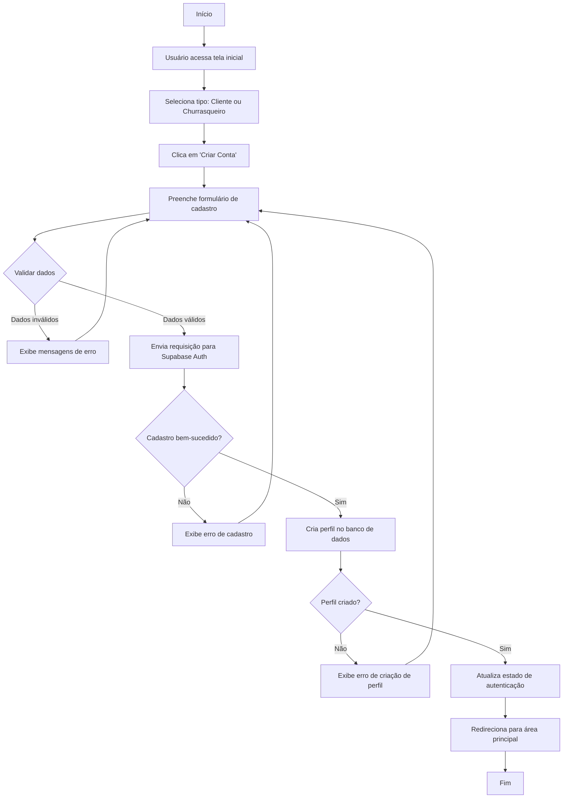

### 1.2 Login de Usuário

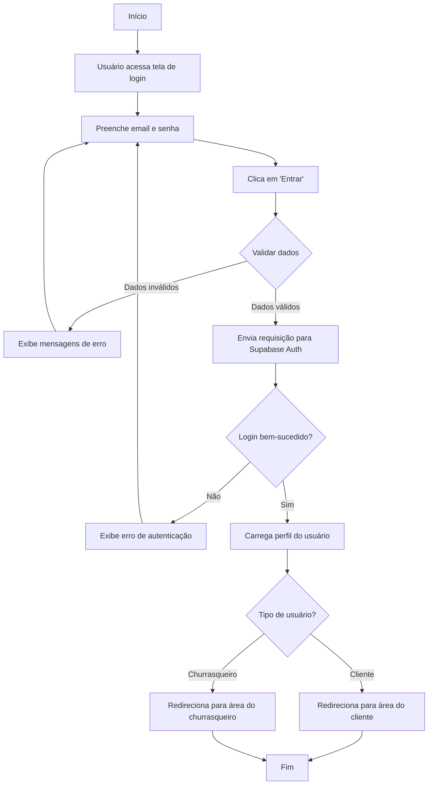

---

## 2. Fluxos do Cliente

### 2.1 Busca e Filtro de Serviços

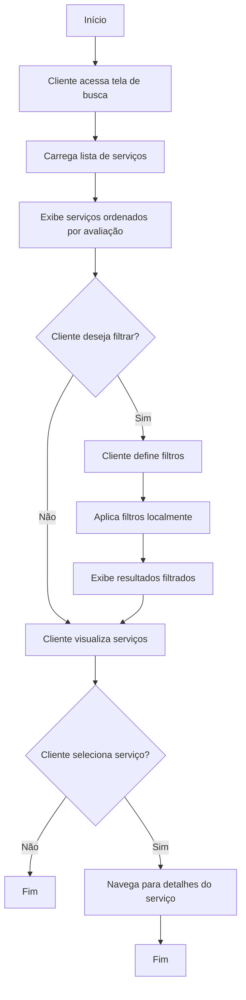

### 2.2 Criação de Reserva

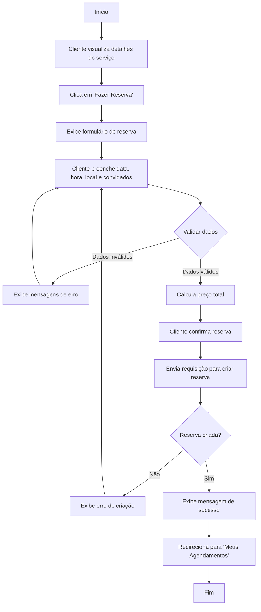

### 2.3 Cancelamento de Reserva

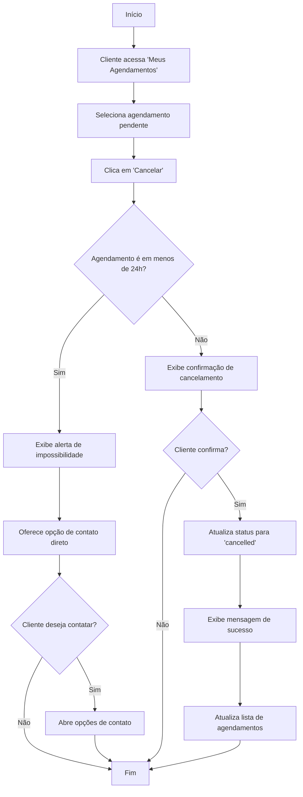

### 2.4 Avaliação de Serviço

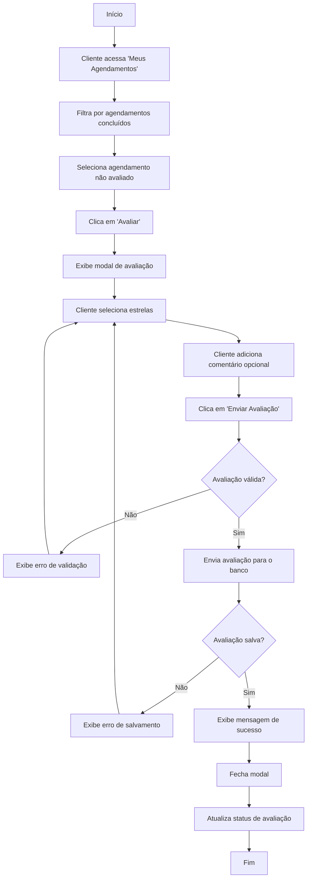

---

## 3. Fluxos do Churrasqueiro

### 3.1 Criação de Serviço

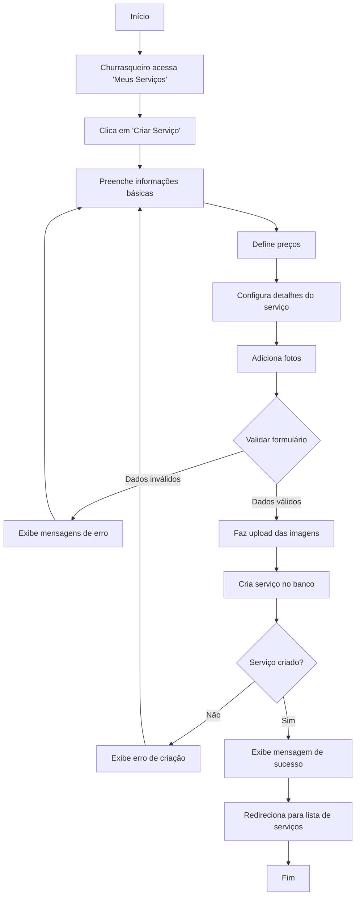

### 3.2 Gestão de Agendamentos

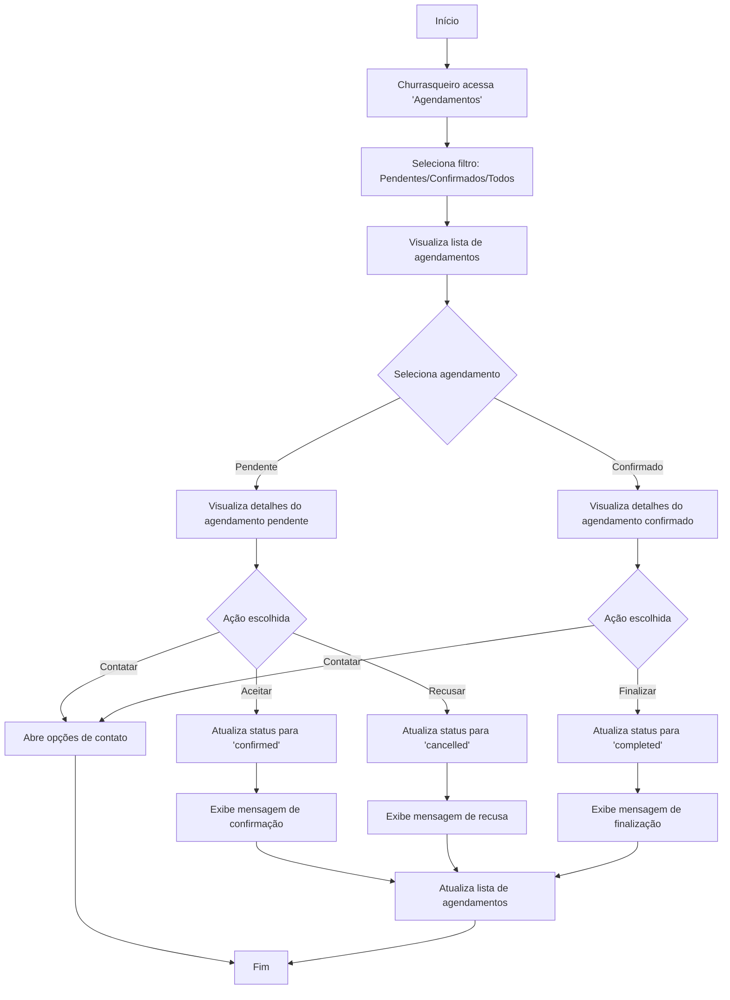

### 3.3 Gestão de Portfólio

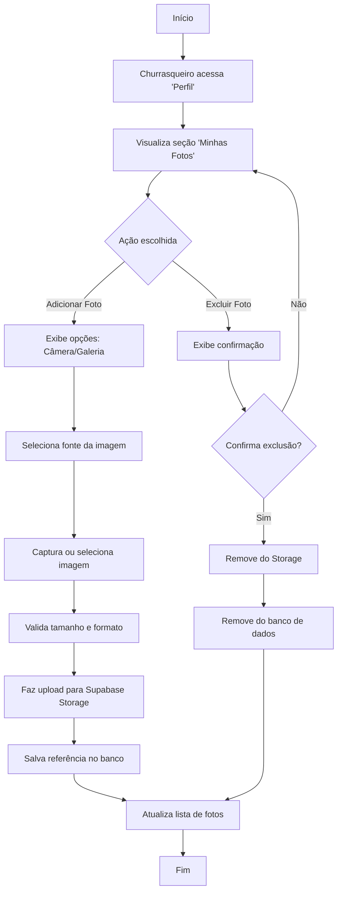

### 3.4 Visualização de Analytics

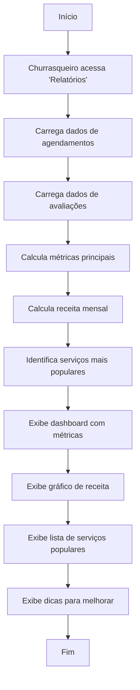

---

## 4. Fluxos de Comunicação

### 4.1 Contato via WhatsApp

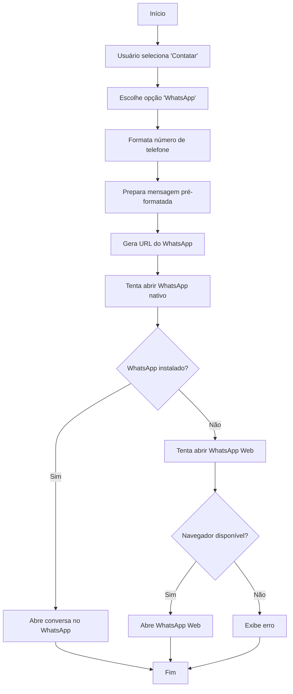

### 4.2 Contato via Email

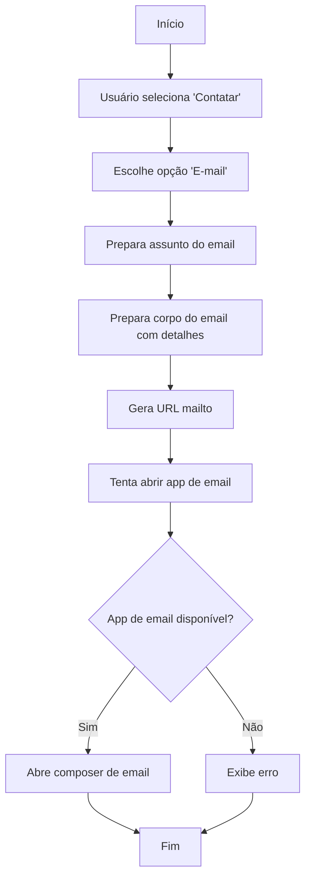

---

## 5. Fluxos de Assinatura

### 5.1 Compra de Assinatura

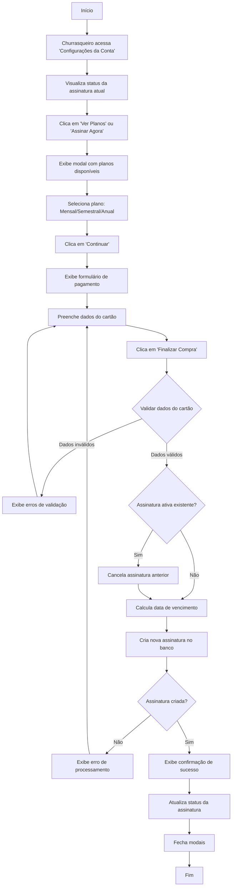

### 5.2 Verificação de Status da Assinatura

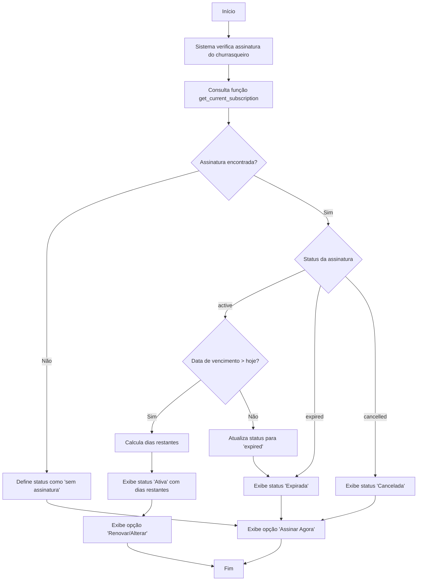

---

## 6. Fluxos de Gestão de Conta

### 6.1 Exclusão de Conta

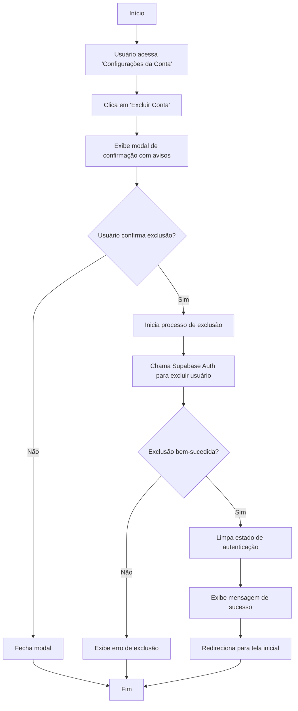

### 6.2 Edição de Perfil

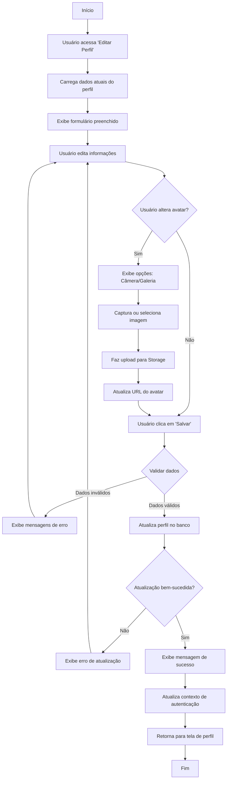

---

## Fluxos Adicionais

### Gestão de Avaliações

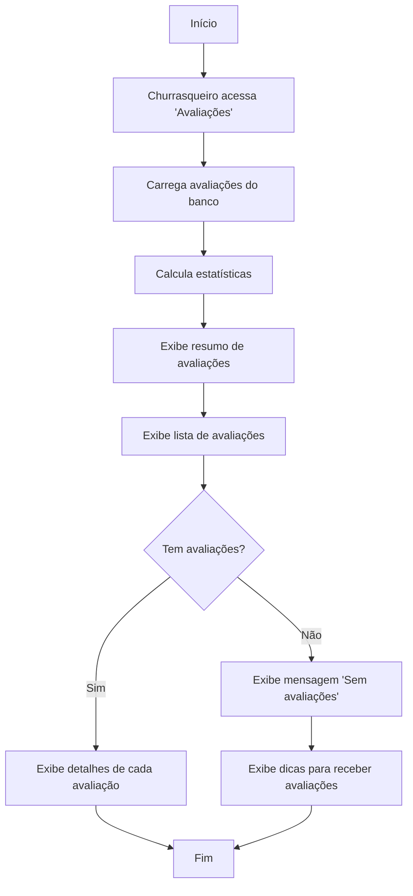

### Processamento de Pagamento

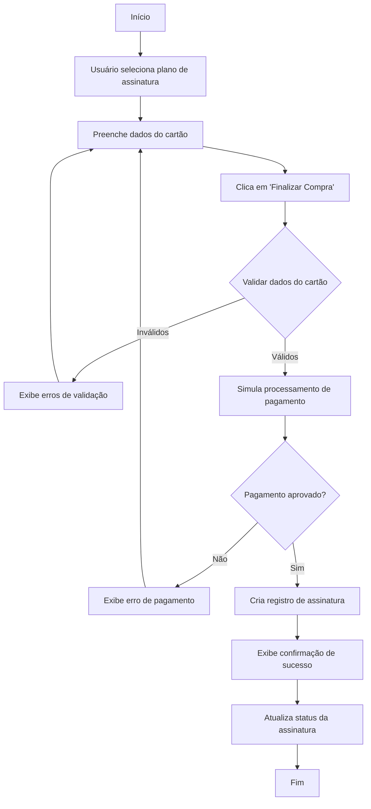

---

## Conclusão

Os diagramas de atividade apresentados neste documento ilustram os principais fluxos de trabalho do sistema ChurrasJa, demonstrando:

1. **Fluxos de Autenticação**: Cadastro e login de usuários
2. **Fluxos do Cliente**: Busca, reserva, cancelamento e avaliação
3. **Fluxos do Churrasqueiro**: Criação de serviços, gestão de agendamentos e portfólio
4. **Fluxos de Comunicação**: Contato via diferentes canais
5. **Fluxos de Assinatura**: Compra e verificação de assinaturas
6. **Fluxos de Gestão de Conta**: Edição de perfil e exclusão de conta

Estes diagramas servem como referência para entender o comportamento do sistema e as interações entre os diferentes componentes e atores. Eles são essenciais para:

- **Desenvolvimento**: Guiar a implementação de funcionalidades
- **Testes**: Definir casos de teste e cenários
- **Documentação**: Facilitar o entendimento do sistema
- **Manutenção**: Auxiliar na identificação de pontos de melhoria

O sistema ChurrasJa implementa todos estes fluxos de forma robusta, garantindo uma experiência completa e intuitiva tanto para clientes quanto para churrasqueiros profissionais.