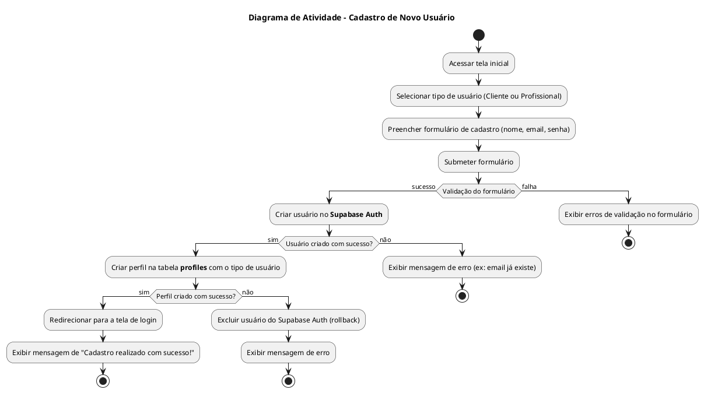
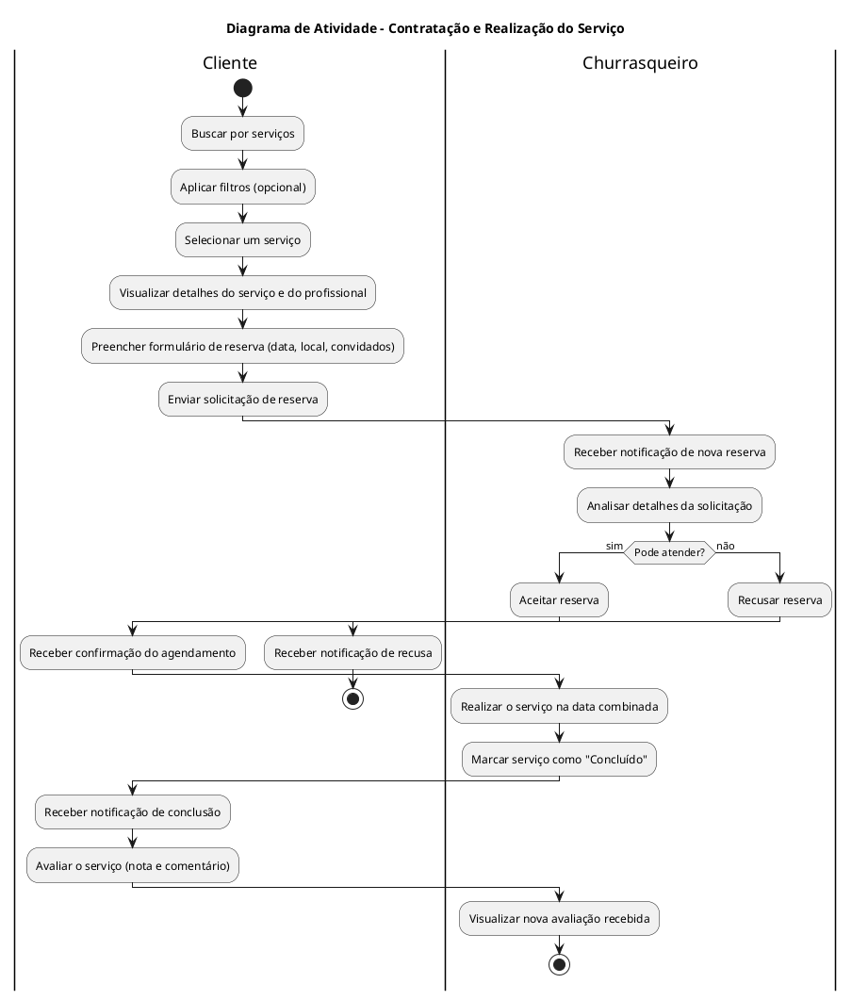

# Diagramas de Atividade - ChurrasJa

Este documento apresenta os principais fluxos de trabalho do sistema ChurrasJa usando diagramas de atividade.

---

## 1. Fluxo de Cadastro de Novo Usuário

Este diagrama mostra o processo de um novo usuário se cadastrando na plataforma, seja como Cliente ou como Churrasqueiro.

---

## 2. Fluxo de Contratação e Realização do Serviço

Este diagrama ilustra o fluxo completo de um serviço, desde a busca pelo cliente até a avaliação final, envolvendo as interações entre o Cliente e o Churrasqueiro.

