# Diagrama de Classes - ChurrasJa

## Visão Geral

Este documento apresenta o diagrama de classes do sistema ChurrasJa, mostrando a estrutura de dados, relacionamentos entre entidades e principais operações do sistema.

## Arquitetura do Sistema

O ChurrasJa utiliza uma arquitetura baseada em:
- **Frontend**: React Native com Expo
- **Backend**: Supabase (PostgreSQL + Auth + Storage)
- **Padrão**: Repository Pattern com Context API para gerenciamento de estado

---

## Diagrama de Classes Principal

```mermaid
classDiagram
    %% Enums
    class UserType {
        <<enumeration>>
        CLIENT
        PROFESSIONAL
    }

    class BookingStatus {
        <<enumeration>>
        PENDING
        CONFIRMED
        CANCELLED
        COMPLETED
    }

    class SubscriptionPlanType {
        <<enumeration>>
        MONTHLY
        SEMESTRAL
        ANNUAL
    }

    class SubscriptionStatus {
        <<enumeration>>
        ACTIVE
        EXPIRED
        CANCELLED
    }

    %% Core Entities
    class User {
        +id: UUID
        +email: string
        +created_at: Date
        +updated_at: Date
        --
        +signIn(email, password): Promise~Session~
        +signUp(email, password): Promise~User~
        +signOut(): Promise~void~
        +resetPassword(email): Promise~void~
    }

    class Profile {
        +id: UUID
        +user_type: UserType
        +full_name: string
        +email: string
        +phone?: string
        +avatar_url?: string
        +location?: string
        +created_at: Date
        +updated_at: Date
        --
        +updateProfile(data): Promise~Profile~
        +uploadAvatar(file): Promise~string~
        +deleteAccount(): Promise~void~
        +getPublicProfile(): PublicProfile
    }

    class Service {
        +id: UUID
        +professional_id: UUID
        +title: string
        +description: string
        +price_from: number
        +price_to?: number
        +duration_hours: number
        +max_guests: number
        +location: string
        +images: string[]
        +created_at: Date
        +updated_at: Date
        --
        +create(data): Promise~Service~
        +update(data): Promise~Service~
        +delete(): Promise~void~
        +uploadImages(files): Promise~string[]~
        +getAverageRating(): Promise~number~
        +getTotalReviews(): Promise~number~
    }

    class Booking {
        +id: UUID
        +client_id: UUID
        +professional_id: UUID
        +service_id: UUID
        +event_date: Date
        +event_time: Time
        +guests_count: number
        +location: string
        +status: BookingStatus
        +total_price: number
        +notes?: string
        +created_at: Date
        +updated_at: Date
        --
        +create(data): Promise~Booking~
        +updateStatus(status): Promise~Booking~
        +cancel(): Promise~Booking~
        +confirm(): Promise~Booking~
        +complete(): Promise~Booking~
        +calculatePrice(): number
        +canBeCancelled(): boolean
        +getTimeUntilEvent(): number
    }

    class Review {
        +id: UUID
        +booking_id: UUID
        +client_id: UUID
        +professional_id: UUID
        +rating: number
        +comment?: string
        +created_at: Date
        +updated_at: Date
        --
        +create(data): Promise~Review~
        +update(data): Promise~Review~
        +delete(): Promise~void~
        +validateRating(rating): boolean
    }

    class ProfessionalPhoto {
        +id: UUID
        +professional_id: UUID
        +photo_url: string
        +created_at: Date
        --
        +upload(file): Promise~ProfessionalPhoto~
        +delete(): Promise~void~
        +getPublicUrl(): string
    }

    class Subscription {
        +id: UUID
        +professional_id: UUID
        +plan_type: SubscriptionPlanType
        +status: SubscriptionStatus
        +start_date: Date
        +end_date: Date
        +amount: number
        +payment_method?: string
        +created_at: Date
        +updated_at: Date
        --
        +create(data): Promise~Subscription~
        +cancel(): Promise~Subscription~
        +renew(plan_type): Promise~Subscription~
        +isActive(): boolean
        +getDaysRemaining(): number
        +calculateEndDate(plan_type): Date
    }

    %% Relationships
    User ||--|| Profile : "has"
    Profile ||--o{ Service : "professional creates"
    Profile ||--o{ Booking : "client books"
    Profile ||--o{ Booking : "professional receives"
    Profile ||--o{ Review : "client writes"
    Profile ||--o{ Review : "professional receives"
    Profile ||--o{ ProfessionalPhoto : "professional uploads"
    Profile ||--o{ Subscription : "professional has"
    
    Service ||--o{ Booking : "is booked"
    Booking ||--o| Review : "can be reviewed"
    
    Profile }o--|| UserType : "has type"
    Booking }o--|| BookingStatus : "has status"
    Subscription }o--|| SubscriptionPlanType : "has plan"
    Subscription }o--|| SubscriptionStatus : "has status"
```

---

## Classes de Contexto e Serviços

```mermaid
classDiagram
    %% Context Classes
    class AuthContext {
        +session: Session | null
        +user: User | null
        +profile: Profile | null
        +loading: boolean
        --
        +signIn(email, password): Promise~void~
        +signUp(email, password, userData): Promise~void~
        +signOut(): Promise~void~
        +refreshProfile(): Promise~void~
        -loadProfile(userId): Promise~void~
        -clearAuthState(): Promise~void~
    }

    %% Service Classes
    class SupabaseService {
        +client: SupabaseClient
        --
        +from(table): QueryBuilder
        +auth: AuthService
        +storage: StorageService
        +rpc(functionName, params): Promise~any~
    }

    class AuthService {
        --
        +signUp(credentials): Promise~AuthResponse~
        +signInWithPassword(credentials): Promise~AuthResponse~
        +signOut(): Promise~void~
        +getSession(): Promise~Session~
        +onAuthStateChange(callback): Subscription
        +admin.deleteUser(id): Promise~void~
    }

    class StorageService {
        --
        +from(bucket): StorageBucket
        +upload(path, file): Promise~StorageResponse~
        +remove(paths): Promise~StorageResponse~
        +getPublicUrl(path): PublicUrlResponse
    }

    class DatabaseService {
        --
        +select(columns): QueryBuilder
        +insert(data): QueryBuilder
        +update(data): QueryBuilder
        +delete(): QueryBuilder
        +eq(column, value): QueryBuilder
        +order(column, options): QueryBuilder
        +limit(count): QueryBuilder
    }

    %% Repository Classes
    class ProfileRepository {
        -supabase: SupabaseService
        --
        +getById(id): Promise~Profile~
        +create(data): Promise~Profile~
        +update(id, data): Promise~Profile~
        +delete(id): Promise~void~
        +getPublicProfiles(): Promise~Profile[]~
    }

    class ServiceRepository {
        -supabase: SupabaseService
        --
        +getAll(): Promise~Service[]~
        +getById(id): Promise~Service~
        +getByProfessional(professionalId): Promise~Service[]~
        +create(data): Promise~Service~
        +update(id, data): Promise~Service~
        +delete(id): Promise~void~
        +search(filters): Promise~Service[]~
    }

    class BookingRepository {
        -supabase: SupabaseService
        --
        +getByClient(clientId): Promise~Booking[]~
        +getByProfessional(professionalId): Promise~Booking[]~
        +getById(id): Promise~Booking~
        +create(data): Promise~Booking~
        +updateStatus(id, status): Promise~Booking~
        +getUpcoming(): Promise~Booking[]~
        +getPast(): Promise~Booking[]~
    }

    class ReviewRepository {
        -supabase: SupabaseService
        --
        +getByProfessional(professionalId): Promise~Review[]~
        +getByClient(clientId): Promise~Review[]~
        +create(data): Promise~Review~
        +update(id, data): Promise~Review~
        +delete(id): Promise~void~
        +getAverageRating(professionalId): Promise~number~
    }

    class SubscriptionRepository {
        -supabase: SupabaseService
        --
        +getCurrent(professionalId): Promise~Subscription~
        +create(data): Promise~Subscription~
        +cancel(id): Promise~Subscription~
        +hasActiveSubscription(professionalId): Promise~boolean~
        +getExpiringSoon(): Promise~Subscription[]~
    }

    %% Relationships
    AuthContext --> SupabaseService
    ProfileRepository --> SupabaseService
    ServiceRepository --> SupabaseService
    BookingRepository --> SupabaseService
    ReviewRepository --> SupabaseService
    SubscriptionRepository --> SupabaseService
    
    SupabaseService --> AuthService
    SupabaseService --> StorageService
    SupabaseService --> DatabaseService
```



---

## Classes de Interface e Componentes

```mermaid
classDiagram
    %% Screen Components
    class WelcomeScreen {
        --
        +handleUserTypeSelection(type): void
        +checkAuthState(): void
        +render(): JSX.Element
    }

    class AuthScreen {
        +userType: UserType
        +isLogin: boolean
        +email: string
        +password: string
        +fullName: string
        +phone: string
        --
        +handleAuth(): Promise~void~
        +validateForm(): boolean
        +toggleMode(): void
        +render(): JSX.Element
    }

    class ClientHomeScreen {
        +featuredServices: Service[]
        +loading: boolean
        --
        +loadFeaturedServices(): Promise~void~
        +handleServicePress(serviceId): void
        +render(): JSX.Element
    }

    class SearchScreen {
        +allServices: Service[]
        +filteredServices: Service[]
        +searchQuery: string
        +filters: FilterState
        --
        +loadServices(): Promise~void~
        +applyFilters(): void
        +handleSearch(query): void
        +render(): JSX.Element
    }

    class ServiceDetailsScreen {
        +service: Service
        +professionalPhotos: ProfessionalPhoto[]
        +bookingForm: BookingForm
        +showBookingForm: boolean
        --
        +loadService(): Promise~void~
        +loadProfessionalPhotos(): Promise~void~
        +handleCreateBooking(): Promise~void~
        +calculateTotalPrice(): number
        +render(): JSX.Element
    }

    class BookingsScreen {
        +bookings: Booking[]
        +activeTab: string
        +selectedBooking: Booking
        --
        +loadBookings(): Promise~void~
        +handleCancelBooking(booking): Promise~void~
        +handleContactProfessional(booking): void
        +openReviewModal(booking): void
        +render(): JSX.Element
    }

    class ProfessionalHomeScreen {
        +stats: DashboardStats
        +recentBookings: Booking[]
        --
        +loadDashboardData(): Promise~void~
        +render(): JSX.Element
    }

    class ServicesManagementScreen {
        +services: Service[]
        +menuVisible: string
        --
        +loadServices(): Promise~void~
        +handleDeleteService(serviceId): Promise~void~
        +render(): JSX.Element
    }

    class CreateServiceScreen {
        +form: ServiceForm
        +images: string[]
        +loading: boolean
        --
        +handleInputChange(field, value): void
        +handleAddImage(): Promise~void~
        +uploadImage(uri): Promise~void~
        +validateForm(): boolean
        +handleCreateService(): Promise~void~
        +render(): JSX.Element
    }

    class ProfessionalBookingsScreen {
        +bookings: Booking[]
        +activeTab: string
        --
        +loadBookings(): Promise~void~
        +updateBookingStatus(id, status): Promise~void~
        +handleContactClient(booking): void
        +render(): JSX.Element
    }

    class ReviewsScreen {
        +reviews: Review[]
        +stats: ReviewStats
        --
        +loadReviews(): Promise~void~
        +calculateStats(reviews): void
        +render(): JSX.Element
    }

    class AnalyticsScreen {
        +analyticsData: AnalyticsData
        +selectedPeriod: string
        --
        +loadAnalyticsData(): Promise~void~
        +formatCurrency(value): string
        +render(): JSX.Element
    }

    class AccountSettingsScreen {
        +currentSubscription: Subscription
        +selectedPlan: SubscriptionPlan
        +paymentForm: PaymentForm
        --
        +loadCurrentSubscription(): Promise~void~
        +handlePurchaseSubscription(): Promise~void~
        +handleDeleteAccount(): Promise~void~
        +render(): JSX.Element
    }

    %% Reusable Components
    class RatingStars {
        +rating: number
        +onRatingChange?: Function
        +size: number
        +readonly: boolean
        --
        +handleStarPress(rating): void
        +renderStar(index): JSX.Element
        +render(): JSX.Element
    }

    class ReviewModal {
        +visible: boolean
        +booking: Booking
        +rating: number
        +comment: string
        --
        +handleSubmitReview(): Promise~void~
        +validateForm(): boolean
        +render(): JSX.Element
    }

    class ReviewsList {
        +professionalId: string
        +reviews: Review[]
        +averageRating: number
        --
        +loadReviews(): Promise~void~
        +calculateStats(): void
        +render(): JSX.Element
    }

    %% Utility Classes
    class ImagePickerUtil {
        --
        +pickImage(source): Promise~ImageResult~
        +requestPermissions(): Promise~boolean~
        +validateImage(asset): boolean
        +formatImage(uri): FormData
    }

    class ValidationUtil {
        --
        +validateEmail(email): boolean
        +validatePhone(phone): boolean
        +validateRequired(value): boolean
        +validateDateRange(start, end): boolean
    }

    class FormatUtil {
        --
        +formatCurrency(value): string
        +formatDate(date): string
        +formatTime(time): string
        +formatCardNumber(number): string
    }

    class NavigationUtil {
        --
        +openWhatsApp(phone, message): Promise~void~
        +makePhoneCall(phone): Promise~void~
        +sendEmail(email, subject, body): Promise~void~
        +openMaps(location): Promise~void~
    }
```



---

## Classes de Tipos e Interfaces

```mermaid
classDiagram
    %% Interface Types
    class IProfile {
        <<interface>>
        +id: string
        +user_type: UserType
        +full_name: string
        +email: string
        +phone?: string
        +avatar_url?: string
        +location?: string
    }

    class IService {
        <<interface>>
        +id: string
        +professional_id: string
        +title: string
        +description: string
        +price_from: number
        +price_to?: number
        +duration_hours: number
        +max_guests: number
        +location: string
        +images: string[]
    }

    class IBooking {
        <<interface>>
        +id: string
        +client_id: string
        +professional_id: string
        +service_id: string
        +event_date: string
        +event_time: string
        +guests_count: number
        +location: string
        +status: BookingStatus
        +total_price: number
        +notes?: string
    }

    class IReview {
        <<interface>>
        +id: string
        +booking_id: string
        +client_id: string
        +professional_id: string
        +rating: number
        +comment?: string
    }

    class ISubscription {
        <<interface>>
        +id: string
        +professional_id: string
        +plan_type: SubscriptionPlanType
        +status: SubscriptionStatus
        +start_date: string
        +end_date: string
        +amount: number
        +payment_method?: string
    }

    %% Form Types
    class ServiceForm {
        +title: string
        +description: string
        +price_from: string
        +price_to: string
        +duration_hours: string
        +max_guests: string
        +location: string
    }

    class BookingForm {
        +event_date: Date
        +event_time: Date
        +guests_count: string
        +location: string
        +notes: string
    }

    class ProfileForm {
        +full_name: string
        +email: string
        +phone: string
        +location: string
    }

    class PaymentForm {
        +cardNumber: string
        +expiryDate: string
        +cvv: string
        +cardholderName: string
    }

    %% Filter Types
    class FilterState {
        +priceRange: string
        +guestCount: string
        +duration: string
        +rating: string
    }

    class SearchFilters {
        +query: string
        +category: string
        +minPrice: number
        +maxPrice: number
        +location: string
        +rating: number
    }

    %% Analytics Types
    class AnalyticsData {
        +totalRevenue: number
        +totalBookings: number
        +averageRating: number
        +totalReviews: number
        +completionRate: number
        +monthlyRevenue: number[]
        +topServices: ServiceStats[]
    }

    class ServiceStats {
        +title: string
        +bookings: number
        +revenue: number
    }

    class ReviewStats {
        +totalReviews: number
        +averageRating: number
        +ratingDistribution: RatingDistribution
    }

    class RatingDistribution {
        +5: number
        +4: number
        +3: number
        +2: number
        +1: number
    }

    %% Configuration Types
    class SubscriptionPlan {
        +type: SubscriptionPlanType
        +name: string
        +price: number
        +duration: string
        +savings?: string
        +popular?: boolean
    }

    class ThemeConfig {
        +colors: ColorScheme
        +spacing: SpacingConfig
        +typography: TypographyConfig
    }

    class ColorScheme {
        +primary: string
        +secondary: string
        +tertiary: string
        +surface: string
        +background: string
        +error: string
        +success: string
    }

    %% Relationships
    Profile ..|> IProfile
    Service ..|> IService
    Booking ..|> IBooking
    Review ..|> IReview
    Subscription ..|> ISubscription
```



---

## Padrões de Design Implementados

### 1. Repository Pattern
```typescript
// Abstração para acesso a dados
interface IRepository<T> {
  getById(id: string): Promise<T | null>;
  getAll(): Promise<T[]>;
  create(data: Partial<T>): Promise<T>;
  update(id: string, data: Partial<T>): Promise<T>;
  delete(id: string): Promise<void>;
}

class BaseRepository<T> implements IRepository<T> {
  constructor(protected supabase: SupabaseClient, protected tableName: string) {}
  
  async getById(id: string): Promise<T | null> {
    const { data, error } = await this.supabase
      .from(this.tableName)
      .select('*')
      .eq('id', id)
      .single();
    
    if (error) throw error;
    return data;
  }
  
  // ... outras implementações
}
```

### 2. Context Pattern
```typescript
// Gerenciamento de estado global
interface AuthContextType {
  session: Session | null;
  user: User | null;
  profile: Profile | null;
  loading: boolean;
  signIn: (email: string, password: string) => Promise<void>;
  signUp: (email: string, password: string, userData: Partial<Profile>) => Promise<void>;
  signOut: () => Promise<void>;
  refreshProfile: () => Promise<void>;
}

const AuthContext = createContext<AuthContextType | undefined>(undefined);

export function useAuth() {
  const context = useContext(AuthContext);
  if (context === undefined) {
    throw new Error('useAuth must be used within an AuthProvider');
  }
  return context;
}
```

### 3. Factory Pattern
```typescript
// Criação de objetos baseada em tipo
class ServiceFactory {
  static createService(type: string, data: any): Service {
    switch (type) {
      case 'traditional':
        return new TraditionalService(data);
      case 'premium':
        return new PremiumService(data);
      case 'vegetarian':
        return new VegetarianService(data);
      default:
        return new BasicService(data);
    }
  }
}
```

### 4. Observer Pattern
```typescript
// Notificações de mudanças de estado
class BookingNotifier {
  private observers: BookingObserver[] = [];
  
  subscribe(observer: BookingObserver): void {
    this.observers.push(observer);
  }
  
  unsubscribe(observer: BookingObserver): void {
    this.observers = this.observers.filter(obs => obs !== observer);
  }
  
  notify(booking: Booking, event: BookingEvent): void {
    this.observers.forEach(observer => observer.update(booking, event));
  }
}
```

### 5. Strategy Pattern
```typescript
// Diferentes estratégias de cálculo de preço
interface PricingStrategy {
  calculatePrice(service: Service, booking: BookingForm): number;
}

class StandardPricing implements PricingStrategy {
  calculatePrice(service: Service, booking: BookingForm): number {
    const basePrice = service.price_from;
    const additionalGuests = Math.max(0, parseInt(booking.guests_count) - 10);
    return basePrice + (additionalGuests * 20);
  }
}

class PremiumPricing implements PricingStrategy {
  calculatePrice(service: Service, booking: BookingForm): number {
    const basePrice = service.price_from;
    const guestMultiplier = parseInt(booking.guests_count) * 0.1;
    return basePrice * (1 + guestMultiplier);
  }
}
```

---

## Relacionamentos e Cardinalidades

### Relacionamentos Principais

1. **User ↔ Profile** (1:1)
   - Um usuário tem exatamente um perfil
   - Um perfil pertence a exatamente um usuário

2. **Profile ↔ Service** (1:N)
   - Um churrasqueiro pode ter múltiplos serviços
   - Um serviço pertence a um churrasqueiro

3. **Profile ↔ Booking** (1:N para cliente, 1:N para profissional)
   - Um cliente pode fazer múltiplas reservas
   - Um churrasqueiro pode receber múltiplas reservas

4. **Service ↔ Booking** (1:N)
   - Um serviço pode ter múltiplas reservas
   - Uma reserva é para um serviço específico

5. **Booking ↔ Review** (1:0..1)
   - Uma reserva pode ter no máximo uma avaliação
   - Uma avaliação pertence a uma reserva específica

6. **Profile ↔ ProfessionalPhoto** (1:N)
   - Um churrasqueiro pode ter múltiplas fotos
   - Uma foto pertence a um churrasqueiro

7. **Profile ↔ Subscription** (1:0..1)
   - Um churrasqueiro pode ter no máximo uma assinatura ativa
   - Uma assinatura pertence a um churrasqueiro

### Regras de Negócio nas Classes

```typescript
class Booking {
  canBeCancelled(): boolean {
    const eventDateTime = new Date(`${this.event_date}T${this.event_time}`);
    const now = new Date();
    const hoursUntilEvent = (eventDateTime.getTime() - now.getTime()) / (1000 * 60 * 60);
    
    return this.status === 'pending' && hoursUntilEvent >= 24;
  }
  
  calculatePrice(): number {
    // Implementação específica baseada no serviço e número de convidados
    const basePrice = this.service.price_from;
    const additionalGuests = Math.max(0, this.guests_count - 10);
    return basePrice + (additionalGuests * 20);
  }
}

class Review {
  validateRating(rating: number): boolean {
    return rating >= 1 && rating <= 5 && Number.isInteger(rating);
  }
}

class Subscription {
  isActive(): boolean {
    return this.status === 'active' && new Date(this.end_date) >= new Date();
  }
  
  getDaysRemaining(): number {
    if (!this.isActive()) return 0;
    const endDate = new Date(this.end_date);
    const today = new Date();
    const diffTime = endDate.getTime() - today.getTime();
    return Math.ceil(diffTime / (1000 * 60 * 60 * 24));
  }
}
```

---

## Segurança e Validação

### Row Level Security (RLS)

```sql
-- Exemplo de políticas RLS implementadas
CREATE POLICY "Users can view their own bookings" 
ON bookings FOR SELECT 
USING (auth.uid() = client_id OR auth.uid() = professional_id);

CREATE POLICY "Clients can create bookings" 
ON bookings FOR INSERT 
WITH CHECK (auth.uid() = client_id);

CREATE POLICY "Professionals can update their services" 
ON services FOR UPDATE 
USING (auth.uid() = professional_id);
```

### Validação de Dados

```typescript
class ValidationService {
  static validateEmail(email: string): boolean {
    const emailRegex = /^[^\s@]+@[^\s@]+\.[^\s@]+$/;
    return emailRegex.test(email);
  }
  
  static validateBookingDate(date: Date): boolean {
    return date > new Date();
  }
  
  static validateGuestCount(count: number, maxGuests: number): boolean {
    return count > 0 && count <= maxGuests;
  }
  
  static validateRating(rating: number): boolean {
    return rating >= 1 && rating <= 5 && Number.isInteger(rating);
  }
}
```

---

## Performance e Otimização

### Índices de Banco de Dados

```sql
-- Índices para otimização de consultas
CREATE INDEX idx_bookings_professional_id ON bookings(professional_id);
CREATE INDEX idx_bookings_client_id ON bookings(client_id);
CREATE INDEX idx_bookings_status ON bookings(status);
CREATE INDEX idx_reviews_professional_id ON reviews(professional_id);
CREATE INDEX idx_services_professional_id ON services(professional_id);
```

### Cache e Otimizações

```typescript
class CacheService {
  private static cache = new Map<string, any>();
  
  static get<T>(key: string): T | null {
    return this.cache.get(key) || null;
  }
  
  static set<T>(key: string, value: T, ttl: number = 300000): void {
    this.cache.set(key, value);
    setTimeout(() => this.cache.delete(key), ttl);
  }
  
  static invalidate(pattern: string): void {
    for (const key of this.cache.keys()) {
      if (key.includes(pattern)) {
        this.cache.delete(key);
      }
    }
  }
}
```

---

## Extensibilidade e Manutenibilidade

### Interface para Novos Tipos de Serviço

```typescript
interface ServiceType {
  calculatePrice(basePrice: number, guests: number): number;
  getRequiredEquipment(): string[];
  getEstimatedDuration(): number;
  validateBooking(booking: BookingForm): ValidationResult;
}

class TraditionalBBQService implements ServiceType {
  calculatePrice(basePrice: number, guests: number): number {
    return basePrice + (Math.max(0, guests - 10) * 20);
  }
  
  getRequiredEquipment(): string[] {
    return ['Churrasqueira', 'Carvão', 'Utensílios'];
  }
  
  // ... outras implementações
}
```

### Plugin System para Funcionalidades

```typescript
interface Plugin {
  name: string;
  version: string;
  initialize(): void;
  destroy(): void;
}

class PaymentPlugin implements Plugin {
  name = 'payment-integration';
  version = '1.0.0';
  
  initialize(): void {
    // Inicializar integração de pagamento
  }
  
  destroy(): void {
    // Limpar recursos
  }
}

class PluginManager {
  private plugins: Map<string, Plugin> = new Map();
  
  register(plugin: Plugin): void {
    this.plugins.set(plugin.name, plugin);
    plugin.initialize();
  }
  
  unregister(name: string): void {
    const plugin = this.plugins.get(name);
    if (plugin) {
      plugin.destroy();
      this.plugins.delete(name);
    }
  }
}
```

---

## Conclusão

O diagrama de classes do ChurrasJa demonstra uma arquitetura bem estruturada que:

### ✅ **Pontos Fortes**
- **Separação clara de responsabilidades** entre entidades de domínio
- **Relacionamentos bem definidos** com cardinalidades apropriadas
- **Padrões de design** aplicados consistentemente
- **Segurança robusta** com RLS e validações
- **Extensibilidade** através de interfaces e abstrações
- **Performance otimizada** com índices e cache

### 🔧 **Características Técnicas**
- **7 entidades principais** com relacionamentos bem definidos
- **4 enums** para tipagem forte
- **Repository Pattern** para acesso a dados
- **Context API** para gerenciamento de estado
- **TypeScript** para type safety
- **Supabase** como backend completo

### 📈 **Escalabilidade**
- **Modular**: Fácil adição de novas funcionalidades
- **Testável**: Interfaces permitem mocking e testes unitários
- **Manutenível**: Código organizado e documentado
- **Performante**: Otimizações de consulta e cache

### 🚀 **Futuras Extensões**
- Sistema de chat em tempo real
- Integração com mapas e geolocalização
- Sistema de cupons e promoções
- Analytics avançados
- Notificações push
- Integração com gateways de pagamento reais

O sistema está preparado para crescer e evoluir mantendo a qualidade e performance.