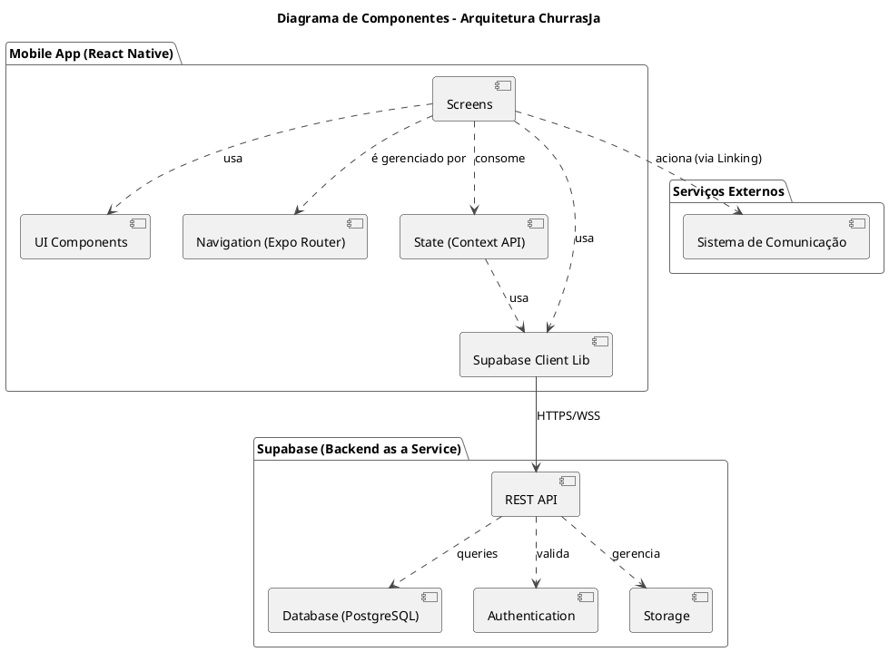

# Diagrama de Componentes - ChurrasJa

Este documento descreve a arquitetura de componentes do sistema ChurrasJa.

### Descrição dos Componentes

- **Mobile App (React Native)**: A aplicação frontend que roda nos dispositivos dos usuários.

  - **UI Components**: Componentes visuais reutilizáveis (botões, cards, inputs) baseados em `react-native-paper` e componentes customizados.
  - **Screens**: As telas da aplicação que o usuário vê e com as quais interage (ex: `ServiceDetailsScreen`, `BookingsScreen`).
  - **Navigation (Expo Router)**: Gerencia a navegação e o roteamento entre as diferentes telas da aplicação.
  - **State (Context API)**: Gerencia o estado global da aplicação, principalmente o estado de autenticação do usuário (`AuthContext`).
  - **Supabase Client Lib**: Um wrapper (`lib/supabase.ts`) que configura e expõe o cliente JavaScript do Supabase para interagir com o backend.

- **Supabase (Backend as a Service)**: A plataforma de backend que fornece todos os serviços necessários.

  - **REST API**: A interface de comunicação auto-gerada que o frontend usa para acessar os dados e serviços do backend.
  - **Database (PostgreSQL)**: O banco de dados relacional onde todos os dados da aplicação (perfis, serviços, agendamentos, etc.) são armazenados.
  - **Authentication**: O serviço que gerencia a identidade dos usuários (cadastro, login, sessões).
  - **Storage**: O serviço responsável por armazenar arquivos, como fotos de perfil, portfólio e serviços.

- **Serviços Externos**:
  - **Sistema de Comunicação**: Representa os aplicativos de terceiros (WhatsApp, Telefone, Email) que são acionados a partir do aplicativo para comunicação direta entre cliente e profissional.
