# Diagrama de Componentes - ChurrasJa

## Visão Geral

Este documento apresenta o diagrama de componentes do sistema ChurrasJa, mostrando a estrutura arquitetural, as relações entre os componentes e as interfaces do sistema.

## Arquitetura do Sistema

O ChurrasJa utiliza uma arquitetura baseada em:
- **Frontend**: React Native com Expo Router
- **Backend**: Supabase (PostgreSQL + Auth + Storage)
- **Padrão**: Arquitetura em camadas com Context API para gerenciamento de estado

---

## Diagrama de Componentes Principal

```mermaid
componentDiagram
    component "ChurrasJa App" {
        component "Camada de Apresentação" {
            component "Telas do Cliente" {
                component "HomeScreen"
                component "SearchScreen"
                component "ServiceDetailsScreen"
                component "BookingsScreen"
                component "ProfileScreen"
                component "EditProfileScreen"
                component "AccountSettingsScreen"
            }
            
            component "Telas do Churrasqueiro" {
                component "ProfessionalHomeScreen"
                component "ServicesManagementScreen"
                component "CreateServiceScreen"
                component "EditServiceScreen"
                component "BookingsManagementScreen"
                component "ReviewsScreen"
                component "AnalyticsScreen"
                component "ProfessionalProfileScreen"
                component "EditProfessionalProfileScreen"
                component "AccountSettingsScreen"
            }
            
            component "Telas Compartilhadas" {
                component "WelcomeScreen"
                component "AuthScreen"
                component "NotFoundScreen"
            }
            
            component "Componentes Reutilizáveis" {
                component "RatingStars"
                component "ReviewModal"
                component "ReviewsList"
            }
        }
        
        component "Camada de Navegação" {
            component "Expo Router" {
                component "ClientTabLayout"
                component "ProfessionalTabLayout"
                component "RootLayout"
                component "AuthLayout"
                component "ServiceDetailsLayout"
                component "ServicesLayout"
            }
        }
        
        component "Camada de Estado" {
            component "Contextos" {
                component "AuthContext"
            }
            
            component "Hooks" {
                component "useFrameworkReady"
                component "useAuth"
            }
        }
        
        component "Camada de Serviços" {
            component "API" {
                component "SupabaseClient"
            }
            
            component "Utilitários" {
                component "ImagePickerUtil"
                component "FormattingUtil"
                component "ValidationUtil"
                component "LinkingUtil"
            }
        }
        
        component "Camada de Configuração" {
            component "Constantes" {
                component "Theme"
                component "Spacing"
            }
        }
    }
    
    component "Supabase Backend" {
        component "Supabase Auth" {
            component "Authentication"
            component "User Management"
        }
        
        component "Supabase Database" {
            component "PostgreSQL" {
                component "Tables" {
                    component "profiles"
                    component "services"
                    component "bookings"
                    component "reviews"
                    component "professional_photos"
                    component "subscriptions"
                }
                
                component "Functions" {
                    component "get_current_subscription()"
                    component "has_active_subscription()"
                    component "update_reviews_updated_at()"
                    component "update_subscriptions_updated_at()"
                }
                
                component "Policies" {
                    component "Row Level Security (RLS)"
                }
            }
        }
        
        component "Supabase Storage" {
            component "Buckets" {
                component "avatars"
                component "professional_photos"
                component "service_images"
            }
        }
    }
    
    component "Sistemas Externos" {
        component "WhatsApp"
        component "Email"
        component "Telefone"
    }
    
    "Camada de Apresentação" --> "Camada de Navegação" : usa
    "Camada de Apresentação" --> "Camada de Estado" : consome
    "Camada de Apresentação" --> "Camada de Serviços" : chama
    "Camada de Apresentação" --> "Camada de Configuração" : referencia
    
    "Camada de Estado" --> "Camada de Serviços" : utiliza
    "Camada de Serviços" --> "Supabase Backend" : comunica
    "Camada de Serviços" --> "Sistemas Externos" : integra
```

---

## Detalhamento dos Componentes

### 1. Camada de Apresentação

#### 1.1 Telas do Cliente

```mermaid
componentDiagram
    component "Telas do Cliente" {
        component "HomeScreen" {
            port "entrada" as HS_in
            port "saída" as HS_out
        }
        
        component "SearchScreen" {
            port "entrada" as SS_in
            port "saída" as SS_out
        }
        
        component "ServiceDetailsScreen" {
            port "entrada" as SDS_in
            port "saída" as SDS_out
        }
        
        component "BookingsScreen" {
            port "entrada" as BS_in
            port "saída" as BS_out
        }
        
        component "ProfileScreen" {
            port "entrada" as PS_in
            port "saída" as PS_out
        }
        
        component "EditProfileScreen" {
            port "entrada" as EPS_in
            port "saída" as EPS_out
        }
        
        component "AccountSettingsScreen" {
            port "entrada" as ASS_in
            port "saída" as ASS_out
        }
    }
    
    HS_out --> SS_in : navega para
    HS_out --> SDS_in : navega para
    PS_out --> EPS_in : navega para
    PS_out --> ASS_in : navega para
    BS_out --> SDS_in : navega para
```

#### 1.2 Telas do Churrasqueiro

```mermaid
componentDiagram
    component "Telas do Churrasqueiro" {
        component "ProfessionalHomeScreen" {
            port "entrada" as PHS_in
            port "saída" as PHS_out
        }
        
        component "ServicesManagementScreen" {
            port "entrada" as SMS_in
            port "saída" as SMS_out
        }
        
        component "CreateServiceScreen" {
            port "entrada" as CSS_in
            port "saída" as CSS_out
        }
        
        component "EditServiceScreen" {
            port "entrada" as ESS_in
            port "saída" as ESS_out
        }
        
        component "BookingsManagementScreen" {
            port "entrada" as BMS_in
            port "saída" as BMS_out
        }
        
        component "ReviewsScreen" {
            port "entrada" as RS_in
            port "saída" as RS_out
        }
        
        component "AnalyticsScreen" {
            port "entrada" as AS_in
            port "saída" as AS_out
        }
        
        component "ProfessionalProfileScreen" {
            port "entrada" as PPS_in
            port "saída" as PPS_out
        }
        
        component "EditProfessionalProfileScreen" {
            port "entrada" as EPPS_in
            port "saída" as EPPS_out
        }
        
        component "AccountSettingsScreen" {
            port "entrada" as PASS_in
            port "saída" as PASS_out
        }
    }
    
    PHS_out --> SMS_in : navega para
    PHS_out --> BMS_in : navega para
    SMS_out --> CSS_in : navega para
    SMS_out --> ESS_in : navega para
    PPS_out --> EPPS_in : navega para
    PPS_out --> PASS_in : navega para
```

#### 1.3 Componentes Reutilizáveis

```mermaid
componentDiagram
    component "Componentes Reutilizáveis" {
        component "RatingStars" {
            port "props" as RS_props
            port "eventos" as RS_events
        }
        
        component "ReviewModal" {
            port "props" as RM_props
            port "eventos" as RM_events
        }
        
        component "ReviewsList" {
            port "props" as RL_props
            port "eventos" as RL_events
        }
    }
    
    component "BookingsScreen" {
        port "usa" as BS_uses
    }
    
    component "ServiceDetailsScreen" {
        port "usa" as SDS_uses
    }
    
    component "ReviewsScreen" {
        port "usa" as RS_uses
    }
    
    BS_uses --> RM_props : passa props
    SDS_uses --> RL_props : passa props
    RS_uses --> RS_props : passa props
    RM_props --> RS_props : usa internamente
```

### 2. Camada de Estado

```mermaid
componentDiagram
    component "Camada de Estado" {
        component "AuthContext" {
            port "provedor" as AC_provider
            port "consumidor" as AC_consumer
        }
        
        component "useAuth" {
            port "entrada" as UA_in
            port "saída" as UA_out
        }
    }
    
    component "RootLayout" {
        port "usa" as RL_uses
    }
    
    component "Telas" {
        port "usa" as T_uses
    }
    
    RL_uses --> AC_provider : envolve aplicação
    T_uses --> UA_in : chama hook
    UA_in --> AC_consumer : consome contexto
    UA_out --> T_uses : retorna estado
```

### 3. Camada de Serviços

```mermaid
componentDiagram
    component "Camada de Serviços" {
        component "SupabaseClient" {
            port "auth" as SC_auth
            port "db" as SC_db
            port "storage" as SC_storage
        }
        
        component "ImagePickerUtil" {
            port "entrada" as IPU_in
            port "saída" as IPU_out
        }
        
        component "FormattingUtil" {
            port "entrada" as FU_in
            port "saída" as FU_out
        }
        
        component "ValidationUtil" {
            port "entrada" as VU_in
            port "saída" as VU_out
        }
        
        component "LinkingUtil" {
            port "entrada" as LU_in
            port "saída" as LU_out
        }
    }
    
    component "AuthContext" {
        port "usa" as AC_uses
    }
    
    component "Telas" {
        port "usa_utils" as T_uses_utils
        port "usa_supabase" as T_uses_supabase
    }
    
    AC_uses --> SC_auth : autentica
    AC_uses --> SC_db : consulta perfil
    T_uses_supabase --> SC_db : CRUD operações
    T_uses_supabase --> SC_storage : upload/download
    T_uses_utils --> IPU_in : seleciona imagens
    T_uses_utils --> FU_in : formata dados
    T_uses_utils --> VU_in : valida entradas
    T_uses_utils --> LU_in : abre apps externos
```

### 4. Supabase Backend

```mermaid
componentDiagram
    component "Supabase Backend" {
        component "Supabase Auth" {
            port "signup" as SA_signup
            port "signin" as SA_signin
            port "signout" as SA_signout
        }
        
        component "Supabase Database" {
            port "query" as SD_query
            port "insert" as SD_insert
            port "update" as SD_update
            port "delete" as SD_delete
            port "rpc" as SD_rpc
        }
        
        component "Supabase Storage" {
            port "upload" as SS_upload
            port "download" as SS_download
            port "delete" as SS_delete
            port "getPublicUrl" as SS_url
        }
    }
    
    component "SupabaseClient" {
        port "auth_client" as SC_auth_client
        port "db_client" as SC_db_client
        port "storage_client" as SC_storage_client
    }
    
    SC_auth_client --> SA_signup : registra usuários
    SC_auth_client --> SA_signin : autentica usuários
    SC_auth_client --> SA_signout : encerra sessões
    
    SC_db_client --> SD_query : consulta dados
    SC_db_client --> SD_insert : insere registros
    SC_db_client --> SD_update : atualiza registros
    SC_db_client --> SD_delete : remove registros
    SC_db_client --> SD_rpc : chama funções
    
    SC_storage_client --> SS_upload : envia arquivos
    SC_storage_client --> SS_download : baixa arquivos
    SC_storage_client --> SS_delete : remove arquivos
    SC_storage_client --> SS_url : obtém URLs
```

---

## Interfaces e Comunicação

### 1. Interface de Autenticação

```mermaid
componentDiagram
    component "AuthContext" {
        port "signIn()" as AC_signIn
        port "signUp()" as AC_signUp
        port "signOut()" as AC_signOut
        port "refreshProfile()" as AC_refresh
    }
    
    component "Supabase Auth" {
        port "signInWithPassword()" as SA_signIn
        port "signUp()" as SA_signUp
        port "signOut()" as SA_signOut
        port "getSession()" as SA_getSession
    }
    
    AC_signIn --> SA_signIn : chama
    AC_signUp --> SA_signUp : chama
    AC_signOut --> SA_signOut : chama
    AC_refresh --> SA_getSession : chama
```

### 2. Interface de Dados

```mermaid
componentDiagram
    component "Telas" {
        port "loadData()" as T_load
        port "saveData()" as T_save
        port "updateData()" as T_update
        port "deleteData()" as T_delete
    }
    
    component "SupabaseClient" {
        port "from().select()" as SC_select
        port "from().insert()" as SC_insert
        port "from().update()" as SC_update
        port "from().delete()" as SC_delete
    }
    
    T_load --> SC_select : chama
    T_save --> SC_insert : chama
    T_update --> SC_update : chama
    T_delete --> SC_delete : chama
```

### 3. Interface de Storage

```mermaid
componentDiagram
    component "Componentes de Upload" {
        port "uploadAvatar()" as CU_avatar
        port "uploadServiceImage()" as CU_service
        port "uploadPortfolioPhoto()" as CU_portfolio
    }
    
    component "SupabaseClient Storage" {
        port "upload()" as SCS_upload
        port "getPublicUrl()" as SCS_url
    }
    
    CU_avatar --> SCS_upload : envia arquivo
    CU_service --> SCS_upload : envia arquivo
    CU_portfolio --> SCS_upload : envia arquivo
    
    SCS_upload --> SCS_url : obtém URL
```

### 4. Interface de Comunicação Externa

```mermaid
componentDiagram
    component "Componentes de Contato" {
        port "handleWhatsAppMessage()" as CC_whatsapp
        port "handlePhoneCall()" as CC_phone
        port "handleEmailMessage()" as CC_email
    }
    
    component "React Native Linking" {
        port "openURL()" as RNL_open
        port "canOpenURL()" as RNL_can
    }
    
    component "Sistemas Externos" {
        port "whatsapp://" as SE_whatsapp
        port "tel://" as SE_phone
        port "mailto:" as SE_email
    }
    
    CC_whatsapp --> RNL_can : verifica
    CC_phone --> RNL_can : verifica
    CC_email --> RNL_can : verifica
    
    RNL_can --> RNL_open : se disponível
    
    RNL_open --> SE_whatsapp : abre WhatsApp
    RNL_open --> SE_phone : abre telefone
    RNL_open --> SE_email : abre email
```

---

## Estrutura de Arquivos

```
app/
├── _layout.tsx                    # Layout raiz da aplicação
├── +not-found.tsx                 # Tela de 404
├── index.tsx                      # Tela de boas-vindas
├── auth/                          # Módulo de autenticação
│   ├── _layout.tsx                # Layout de autenticação
│   └── index.tsx                  # Tela de login/cadastro
├── (client)/                      # Módulo do cliente
│   ├── _layout.tsx                # Layout de tabs do cliente
│   ├── index.tsx                  # Home do cliente
│   ├── search.tsx                 # Busca de serviços
│   ├── bookings.tsx               # Agendamentos do cliente
│   ├── profile.tsx                # Perfil do cliente
│   ├── edit-profile.tsx           # Edição de perfil
│   ├── account-settings.tsx       # Configurações da conta
│   └── service-details/           # Detalhes do serviço
│       ├── _layout.tsx            # Layout de detalhes
│       └── [id].tsx               # Tela de detalhes dinâmica
└── (professional)/                # Módulo do churrasqueiro
    ├── _layout.tsx                # Layout de tabs do churrasqueiro
    ├── index.tsx                  # Home do churrasqueiro
    ├── bookings.tsx               # Agendamentos do churrasqueiro
    ├── reviews.tsx                # Avaliações recebidas
    ├── analytics.tsx              # Relatórios e métricas
    ├── profile.tsx                # Perfil do churrasqueiro
    ├── edit-profile.tsx           # Edição de perfil
    ├── account-settings.tsx       # Configurações da conta
    └── services/                  # Gestão de serviços
        ├── _layout.tsx            # Layout de serviços
        ├── index.tsx              # Lista de serviços
        ├── create.tsx             # Criação de serviço
        └── edit/                  # Edição de serviço
            └── [id].tsx           # Tela de edição dinâmica

components/                        # Componentes reutilizáveis
├── RatingStars.tsx                # Componente de estrelas
├── ReviewModal.tsx                # Modal de avaliação
└── ReviewsList.tsx                # Lista de avaliações

contexts/                          # Contextos de estado
└── AuthContext.tsx                # Contexto de autenticação

hooks/                             # Hooks personalizados
└── useFrameworkReady.ts           # Hook de inicialização

lib/                               # Bibliotecas e utilitários
└── supabase.ts                    # Cliente Supabase

constants/                         # Constantes da aplicação
└── theme.ts                       # Tema e estilos

docs/                              # Documentação
├── use-case-diagrams.md           # Diagramas de caso de uso
├── sequence-diagrams.md           # Diagramas de sequência
├── class-diagram.md               # Diagrama de classes
└── activity-diagram.md            # Diagrama de atividades
```

---

## Dependências e Tecnologias

### Principais Dependências

```mermaid
flowchart TD
    A[ChurrasJa App] --> B[React Native]
    A --> C[Expo]
    A --> D[Supabase]
    
    B --> B1[react-native-paper]
    B --> B2[react-native-safe-area-context]
    
    C --> C1[expo-router]
    C --> C2[expo-image-picker]
    C --> C3[expo-linear-gradient]
    
    D --> D1[@supabase/supabase-js]
    
    A --> E[lucide-react-native]
    A --> F[@react-native-community/datetimepicker]
```

### Tecnologias por Camada

| Camada | Tecnologias |
|--------|-------------|
| **Apresentação** | React Native, React Native Paper, Lucide React Native |
| **Navegação** | Expo Router, React Navigation |
| **Estado** | Context API, React Hooks |
| **Serviços** | Supabase Client, Expo Image Picker, React Native Linking |
| **Backend** | Supabase (PostgreSQL, Auth, Storage) |
| **Estilo** | StyleSheet, Tema personalizado |

---

## Padrões Arquiteturais

### 1. Arquitetura em Camadas

O sistema segue uma arquitetura em camadas bem definidas:

1. **Camada de Apresentação**: Componentes de UI e telas
2. **Camada de Navegação**: Roteamento e fluxo de navegação
3. **Camada de Estado**: Gerenciamento de estado global
4. **Camada de Serviços**: Comunicação com APIs e serviços externos
5. **Camada de Dados**: Acesso e manipulação de dados

### 2. Padrão Context-Provider


### 3. Padrão Repository


### 4. Padrão de Composição de Componentes

```mermaid
flowchart TD
    A[Telas] --> B[Componentes Compostos]
    B --> C[Componentes Básicos]
    C --> D[Primitivos UI]
```



---

## Segurança e Privacidade

### Row Level Security (RLS)

```mermaid
flowchart TD
    A[Requisição do Cliente] --> B{Autenticado?}
    B -- Não --> C[Acesso Negado]
    B -- Sim --> D{Política RLS}
    D -- Não Autorizado --> C
    D -- Autorizado --> E[Acesso Concedido]
    
    subgraph Políticas RLS
        F[Usuários veem apenas seus dados]
        G[Churrasqueiros gerenciam apenas seus serviços]
        H[Clientes criam reservas apenas para si]
        I[Avaliações apenas para serviços concluídos]
    end
```

### Validação de Dados

```mermaid
flowchart TD
    A[Entrada do Usuário] --> B[Validação Frontend]
    B --> C{Válido?}
    C -- Não --> D[Exibe Erro]
    C -- Sim --> E[Envia para Backend]
    E --> F[Validação Backend]
    F --> G{Válido?}
    G -- Não --> H[Retorna Erro]
    G -- Sim --> I[Processa Dados]
```



---

## Escalabilidade e Extensibilidade

### Arquitetura Modular

```mermaid
flowchart TD
    A[ChurrasJa App] --> B[Módulo Cliente]
    A --> C[Módulo Churrasqueiro]
    A --> D[Módulo Autenticação]
    A --> E[Módulo Compartilhado]
    
    B --> B1[Submódulos]
    C --> C1[Submódulos]
    
    F[Novos Módulos] -.-> A
```



### Extensões Futuras

```mermaid
flowchart TD
    A[ChurrasJa App] --> B[Componentes Atuais]
    A -.-> C[Chat em Tempo Real]
    A -.-> D[Geolocalização]
    A -.-> E[Sistema de Favoritos]
    A -.-> F[Agendamento Recorrente]
    A -.-> G[Gateway de Pagamento Real]
    A -.-> H[Notificações Push]
```



---

## Conclusão

O diagrama de componentes do ChurrasJa demonstra uma arquitetura bem organizada e modular, com:

### ✅ **Pontos Fortes**
- **Separação clara de responsabilidades** entre camadas
- **Componentes reutilizáveis** para funcionalidades comuns
- **Interfaces bem definidas** entre componentes
- **Segurança robusta** com RLS e validações
- **Extensibilidade** através de arquitetura modular

### 🔧 **Características Técnicas**
- **Expo Router** para navegação declarativa
- **Context API** para gerenciamento de estado
- **Supabase** como backend completo
- **React Native Paper** para UI consistente
- **TypeScript** para type safety

### 📈 **Escalabilidade**
- **Modular**: Fácil adição de novos módulos
- **Desacoplado**: Baixo acoplamento entre componentes
- **Testável**: Interfaces claras facilitam testes
- **Manutenível**: Organização lógica de arquivos

O sistema está estruturado para crescer e evoluir mantendo a qualidade e performance, com interfaces claras entre componentes e uma separação lógica de responsabilidades.