# Diagramas de Sequência - ChurrasJa

## Visão Geral

Este documento apresenta os diagramas de sequência dos principais fluxos do sistema ChurrasJa, mostrando as interações entre usuários, frontend, backend (Supabase) e sistemas externos.

## Atores e Componentes

### Atores
- **Cliente**: Usuário que busca e contrata serviços de churrasco
- **Churrasqueiro**: Profissional que oferece serviços de churrasco

### Componentes do Sistema
- **Frontend**: Aplicação React Native (Expo)
- **Supabase Auth**: Sistema de autenticação
- **Supabase DB**: Banco de dados PostgreSQL
- **Supabase Storage**: Armazenamento de arquivos
- **WhatsApp**: Sistema externo de mensagens
- **Email**: Sistema externo de email
- **Telefone**: Sistema nativo de chamadas

---

## 1. Fluxo de Autenticação

### 1.1 Cadastro de Usuário

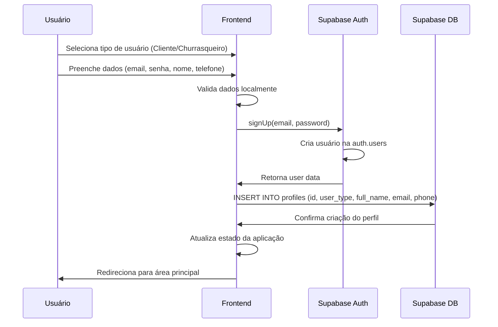
```mermaid
sequenceDiagram
    participant U as Usuário
    participant F as Frontend
    participant SA as Supabase Auth
    participant DB as Supabase DB

    U->>F: Seleciona tipo de usuário (Cliente/Churrasqueiro)
    U->>F: Preenche dados (email, senha, nome, telefone)
    F->>F: Valida dados localmente
    F->>SA: signUp(email, password)
    SA->>SA: Cria usuário na auth.users
    SA->>F: Retorna user data
    F->>DB: INSERT INTO profiles (id, user_type, full_name, email, phone)
    DB->>F: Confirma criação do perfil
    F->>F: Atualiza estado da aplicação
    F->>U: Redireciona para área principal
```

### 1.2 Login de Usuário

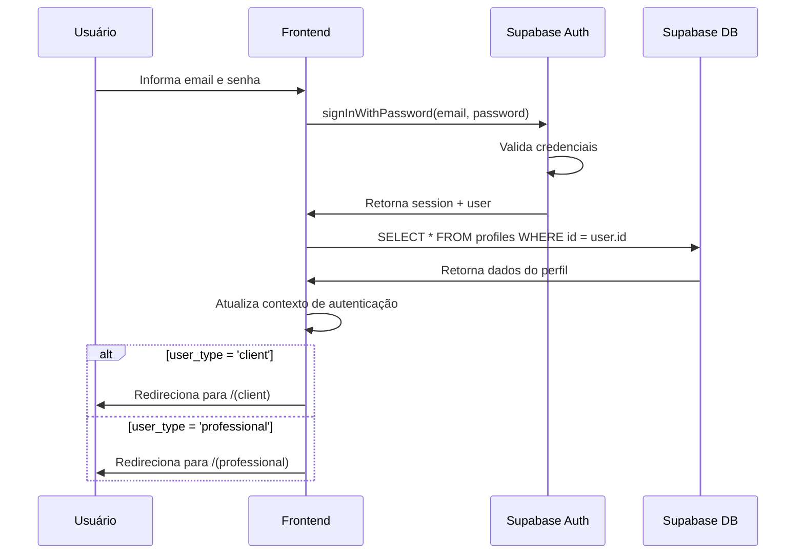
```mermaid
sequenceDiagram
    participant U as Usuário
    participant F as Frontend
    participant SA as Supabase Auth
    participant DB as Supabase DB

    U->>F: Informa email e senha
    F->>SA: signInWithPassword(email, password)
    SA->>SA: Valida credenciais
    SA->>F: Retorna session + user
    F->>DB: SELECT * FROM profiles WHERE id = user.id
    DB->>F: Retorna dados do perfil
    F->>F: Atualiza contexto de autenticação
    alt user_type = 'client'
        F->>U: Redireciona para /(client)
    else user_type = 'professional'
        F->>U: Redireciona para /(professional)
    end
```

---

## 2. Fluxo de Gestão de Serviços (Churrasqueiro)

### 2.1 Criação de Serviço

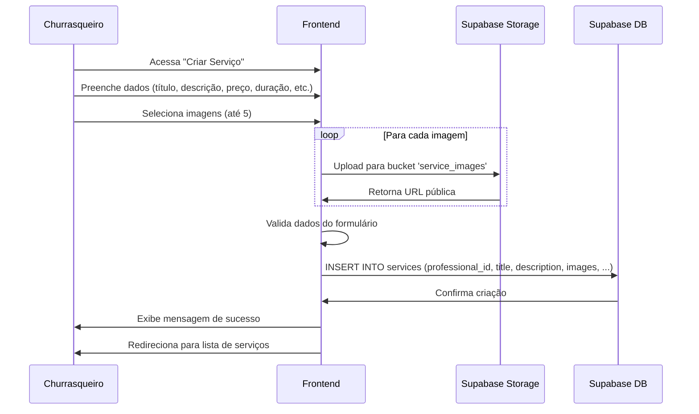
```mermaid
sequenceDiagram
    participant C as Churrasqueiro
    participant F as Frontend
    participant ST as Supabase Storage
    participant DB as Supabase DB

    C->>F: Acessa "Criar Serviço"
    C->>F: Preenche dados (título, descrição, preço, duração, etc.)
    C->>F: Seleciona imagens (até 5)
    
    loop Para cada imagem
        F->>ST: Upload para bucket 'service_images'
        ST->>F: Retorna URL pública
    end
    
    F->>F: Valida dados do formulário
    F->>DB: INSERT INTO services (professional_id, title, description, images, ...)
    DB->>F: Confirma criação
    F->>C: Exibe mensagem de sucesso
    F->>C: Redireciona para lista de serviços
```

### 2.2 Edição de Serviço

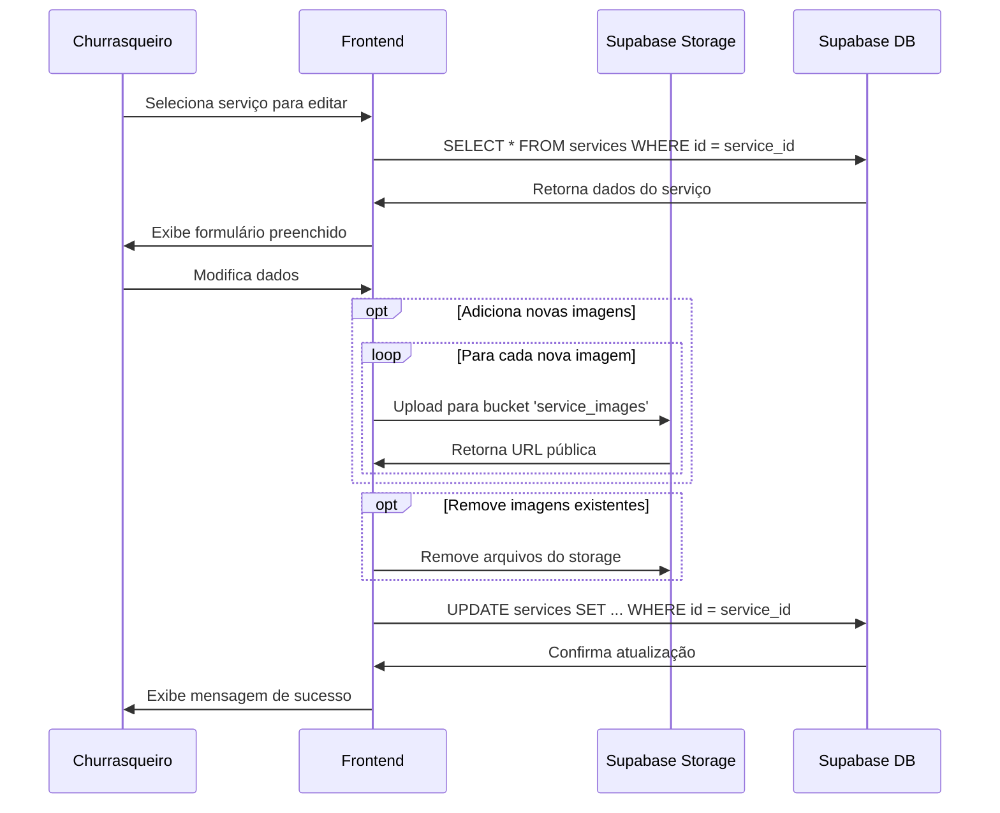
```mermaid
sequenceDiagram
    participant C as Churrasqueiro
    participant F as Frontend
    participant ST as Supabase Storage
    participant DB as Supabase DB

    C->>F: Seleciona serviço para editar
    F->>DB: SELECT * FROM services WHERE id = service_id
    DB->>F: Retorna dados do serviço
    F->>C: Exibe formulário preenchido
    C->>F: Modifica dados
    
    opt Adiciona novas imagens
        loop Para cada nova imagem
            F->>ST: Upload para bucket 'service_images'
            ST->>F: Retorna URL pública
        end
    end
    
    opt Remove imagens existentes
        F->>ST: Remove arquivos do storage
    end
    
    F->>DB: UPDATE services SET ... WHERE id = service_id
    DB->>F: Confirma atualização
    F->>C: Exibe mensagem de sucesso
```

---

## 3. Fluxo de Busca e Reserva (Cliente)

### 3.1 Busca de Serviços

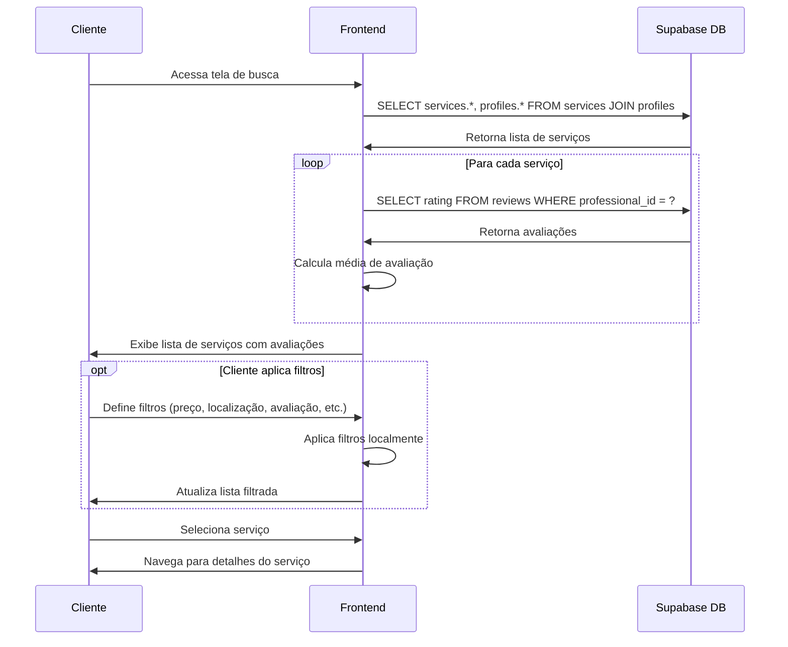
```mermaid
sequenceDiagram
    participant C as Cliente
    participant F as Frontend
    participant DB as Supabase DB

    C->>F: Acessa tela de busca
    F->>DB: SELECT services.*, profiles.* FROM services JOIN profiles
    DB->>F: Retorna lista de serviços
    
    loop Para cada serviço
        F->>DB: SELECT rating FROM reviews WHERE professional_id = ?
        DB->>F: Retorna avaliações
        F->>F: Calcula média de avaliação
    end
    
    F->>C: Exibe lista de serviços com avaliações
    
    opt Cliente aplica filtros
        C->>F: Define filtros (preço, localização, avaliação, etc.)
        F->>F: Aplica filtros localmente
        F->>C: Atualiza lista filtrada
    end
    
    C->>F: Seleciona serviço
    F->>C: Navega para detalhes do serviço
```

### 3.2 Criação de Reserva

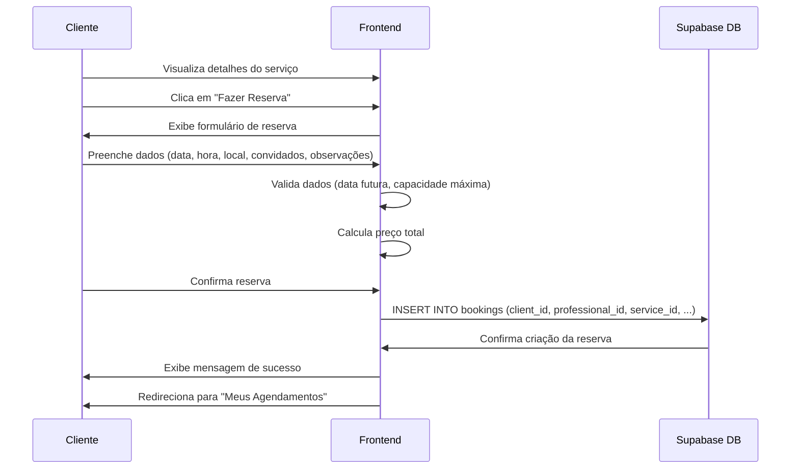
```mermaid
sequenceDiagram
    participant C as Cliente
    participant F as Frontend
    participant DB as Supabase DB

    C->>F: Visualiza detalhes do serviço
    C->>F: Clica em "Fazer Reserva"
    F->>C: Exibe formulário de reserva
    C->>F: Preenche dados (data, hora, local, convidados, observações)
    F->>F: Valida dados (data futura, capacidade máxima)
    F->>F: Calcula preço total
    C->>F: Confirma reserva
    
    F->>DB: INSERT INTO bookings (client_id, professional_id, service_id, ...)
    DB->>F: Confirma criação da reserva
    F->>C: Exibe mensagem de sucesso
    F->>C: Redireciona para "Meus Agendamentos"
```

---

## 4. Fluxo de Gestão de Agendamentos

### 4.1 Churrasqueiro Aceita/Recusa Agendamento

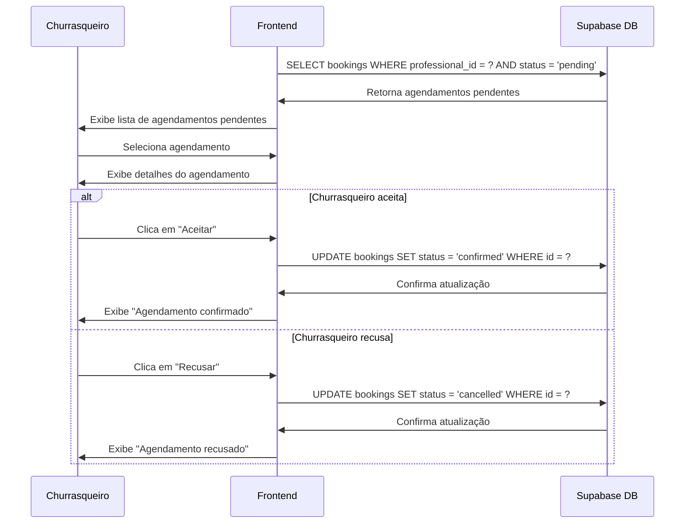
```mermaid
sequenceDiagram
    participant C as Churrasqueiro
    participant F as Frontend
    participant DB as Supabase DB

    F->>DB: SELECT bookings WHERE professional_id = ? AND status = 'pending'
    DB->>F: Retorna agendamentos pendentes
    F->>C: Exibe lista de agendamentos pendentes
    
    C->>F: Seleciona agendamento
    F->>C: Exibe detalhes do agendamento
    
    alt Churrasqueiro aceita
        C->>F: Clica em "Aceitar"
        F->>DB: UPDATE bookings SET status = 'confirmed' WHERE id = ?
        DB->>F: Confirma atualização
        F->>C: Exibe "Agendamento confirmado"
    else Churrasqueiro recusa
        C->>F: Clica em "Recusar"
        F->>DB: UPDATE bookings SET status = 'cancelled' WHERE id = ?
        DB->>F: Confirma atualização
        F->>C: Exibe "Agendamento recusado"
    end
```

### 4.2 Finalização de Agendamento

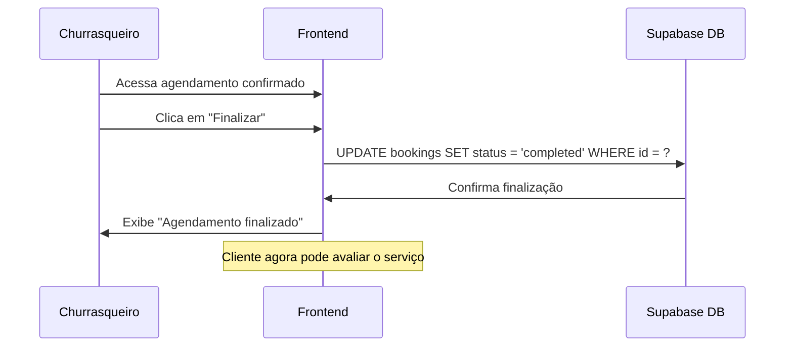
```mermaid
sequenceDiagram
    participant C as Churrasqueiro
    participant F as Frontend
    participant DB as Supabase DB

    C->>F: Acessa agendamento confirmado
    C->>F: Clica em "Finalizar"
    F->>DB: UPDATE bookings SET status = 'completed' WHERE id = ?
    DB->>F: Confirma finalização
    F->>C: Exibe "Agendamento finalizado"
    
    Note over F: Cliente agora pode avaliar o serviço
```

---

## 5. Fluxo de Avaliação

### 5.1 Cliente Avalia Churrasqueiro

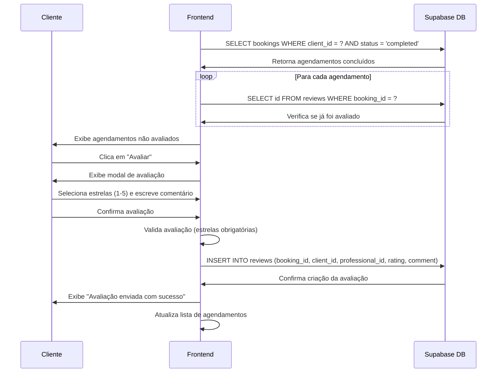
```mermaid
sequenceDiagram
    participant C as Cliente
    participant F as Frontend
    participant DB as Supabase DB

    F->>DB: SELECT bookings WHERE client_id = ? AND status = 'completed'
    DB->>F: Retorna agendamentos concluídos
    
    loop Para cada agendamento
        F->>DB: SELECT id FROM reviews WHERE booking_id = ?
        DB->>F: Verifica se já foi avaliado
    end
    
    F->>C: Exibe agendamentos não avaliados
    C->>F: Clica em "Avaliar"
    F->>C: Exibe modal de avaliação
    C->>F: Seleciona estrelas (1-5) e escreve comentário
    C->>F: Confirma avaliação
    
    F->>F: Valida avaliação (estrelas obrigatórias)
    F->>DB: INSERT INTO reviews (booking_id, client_id, professional_id, rating, comment)
    DB->>F: Confirma criação da avaliação
    F->>C: Exibe "Avaliação enviada com sucesso"
    F->>F: Atualiza lista de agendamentos
```

### 5.2 Churrasqueiro Visualiza Avaliações

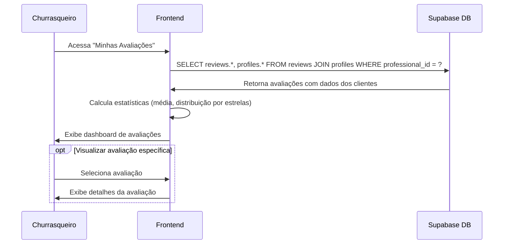
```mermaid
sequenceDiagram
    participant C as Churrasqueiro
    participant F as Frontend
    participant DB as Supabase DB

    C->>F: Acessa "Minhas Avaliações"
    F->>DB: SELECT reviews.*, profiles.* FROM reviews JOIN profiles WHERE professional_id = ?
    DB->>F: Retorna avaliações com dados dos clientes
    
    F->>F: Calcula estatísticas (média, distribuição por estrelas)
    F->>C: Exibe dashboard de avaliações
    
    opt Visualizar avaliação específica
        C->>F: Seleciona avaliação
        F->>C: Exibe detalhes da avaliação
    end
```

---

## 6. Fluxo de Comunicação

### 6.1 Contato via WhatsApp

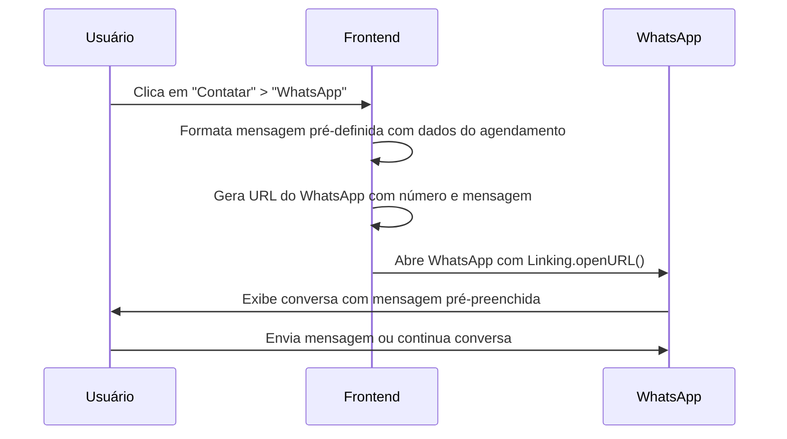
```mermaid
sequenceDiagram
    participant U as Usuário
    participant F as Frontend
    participant WA as WhatsApp

    U->>F: Clica em "Contatar" > "WhatsApp"
    F->>F: Formata mensagem pré-definida com dados do agendamento
    F->>F: Gera URL do WhatsApp com número e mensagem
    F->>WA: Abre WhatsApp com Linking.openURL()
    WA->>U: Exibe conversa com mensagem pré-preenchida
    U->>WA: Envia mensagem ou continua conversa
```

### 6.2 Contato via Email

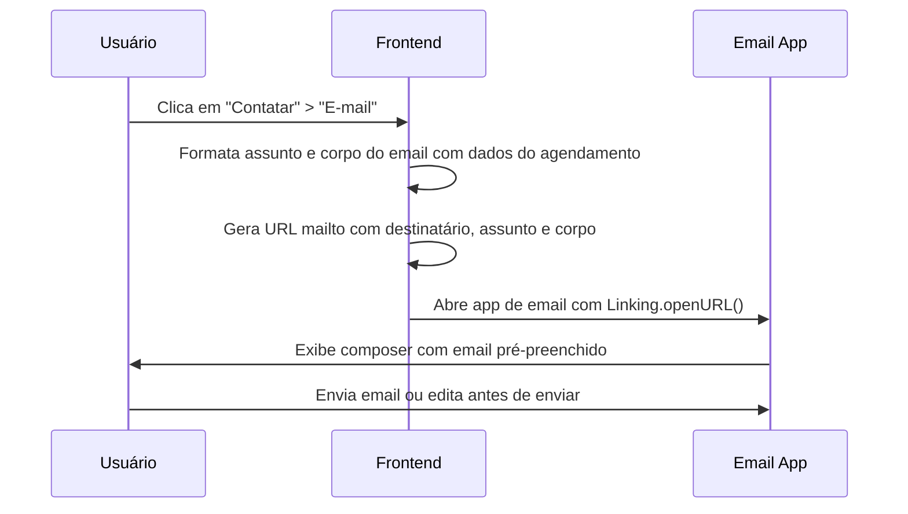
```mermaid
sequenceDiagram
    participant U as Usuário
    participant F as Frontend
    participant E as Email App

    U->>F: Clica em "Contatar" > "E-mail"
    F->>F: Formata assunto e corpo do email com dados do agendamento
    F->>F: Gera URL mailto com destinatário, assunto e corpo
    F->>E: Abre app de email com Linking.openURL()
    E->>U: Exibe composer com email pré-preenchido
    U->>E: Envia email ou edita antes de enviar
```

### 6.3 Contato via Telefone

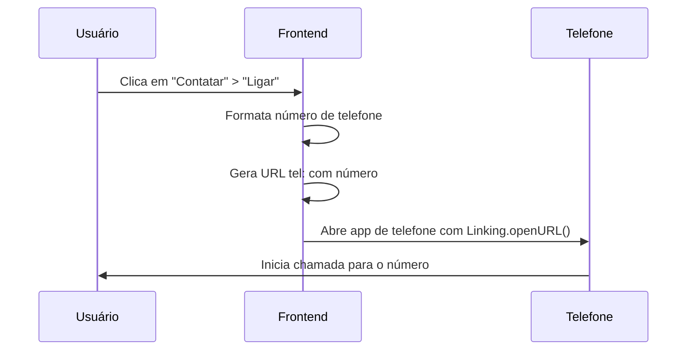
```mermaid
sequenceDiagram
    participant U as Usuário
    participant F as Frontend
    participant T as Telefone

    U->>F: Clica em "Contatar" > "Ligar"
    F->>F: Formata número de telefone
    F->>F: Gera URL tel: com número
    F->>T: Abre app de telefone com Linking.openURL()
    T->>U: Inicia chamada para o número
```

---

## 7. Fluxo de Upload de Imagens

### 7.1 Upload de Avatar

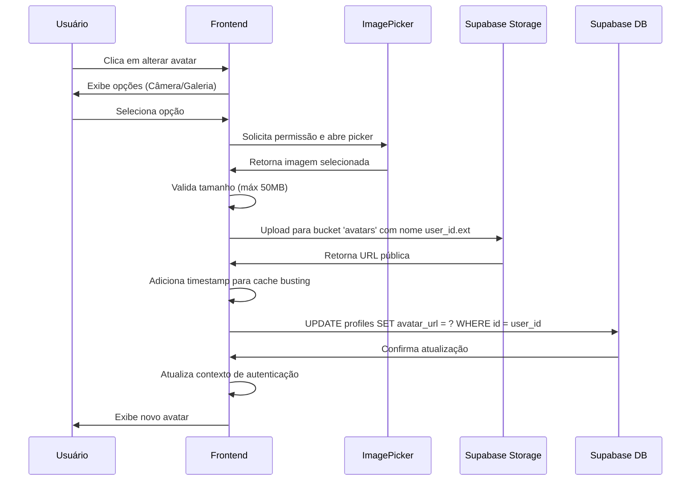
```mermaid
sequenceDiagram
    participant U as Usuário
    participant F as Frontend
    participant IP as ImagePicker
    participant ST as Supabase Storage
    participant DB as Supabase DB

    U->>F: Clica em alterar avatar
    F->>U: Exibe opções (Câmera/Galeria)
    U->>F: Seleciona opção
    F->>IP: Solicita permissão e abre picker
    IP->>F: Retorna imagem selecionada
    F->>F: Valida tamanho (máx 50MB)
    
    F->>ST: Upload para bucket 'avatars' com nome user_id.ext
    ST->>F: Retorna URL pública
    F->>F: Adiciona timestamp para cache busting
    F->>DB: UPDATE profiles SET avatar_url = ? WHERE id = user_id
    DB->>F: Confirma atualização
    F->>F: Atualiza contexto de autenticação
    F->>U: Exibe novo avatar
```

### 7.2 Upload de Fotos do Portfólio

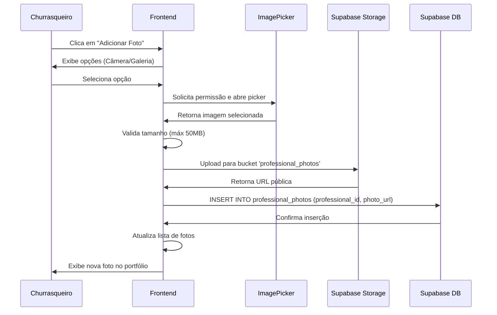
```mermaid
sequenceDiagram
    participant C as Churrasqueiro
    participant F as Frontend
    participant IP as ImagePicker
    participant ST as Supabase Storage
    participant DB as Supabase DB

    C->>F: Clica em "Adicionar Foto"
    F->>C: Exibe opções (Câmera/Galeria)
    C->>F: Seleciona opção
    F->>IP: Solicita permissão e abre picker
    IP->>F: Retorna imagem selecionada
    F->>F: Valida tamanho (máx 50MB)
    
    F->>ST: Upload para bucket 'professional_photos'
    ST->>F: Retorna URL pública
    F->>DB: INSERT INTO professional_photos (professional_id, photo_url)
    DB->>F: Confirma inserção
    F->>F: Atualiza lista de fotos
    F->>C: Exibe nova foto no portfólio
```

---

## 8. Fluxo de Sistema de Assinatura

### 8.1 Compra de Assinatura

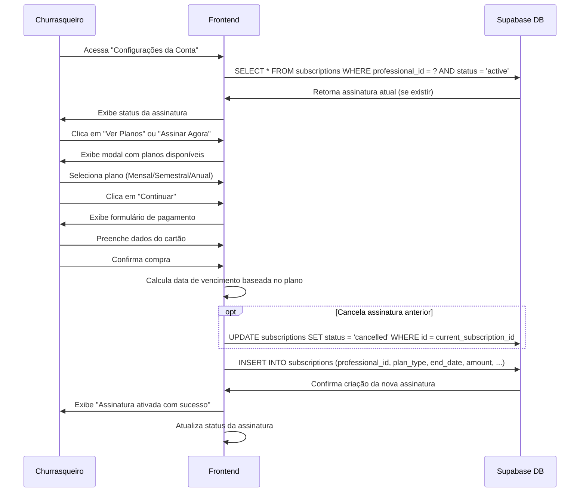
```mermaid
sequenceDiagram
    participant C as Churrasqueiro
    participant F as Frontend
    participant DB as Supabase DB

    C->>F: Acessa "Configurações da Conta"
    F->>DB: SELECT * FROM subscriptions WHERE professional_id = ? AND status = 'active'
    DB->>F: Retorna assinatura atual (se existir)
    F->>C: Exibe status da assinatura
    
    C->>F: Clica em "Ver Planos" ou "Assinar Agora"
    F->>C: Exibe modal com planos disponíveis
    C->>F: Seleciona plano (Mensal/Semestral/Anual)
    C->>F: Clica em "Continuar"
    F->>C: Exibe formulário de pagamento
    C->>F: Preenche dados do cartão
    C->>F: Confirma compra
    
    F->>F: Calcula data de vencimento baseada no plano
    
    opt Cancela assinatura anterior
        F->>DB: UPDATE subscriptions SET status = 'cancelled' WHERE id = current_subscription_id
    end
    
    F->>DB: INSERT INTO subscriptions (professional_id, plan_type, end_date, amount, ...)
    DB->>F: Confirma criação da nova assinatura
    F->>C: Exibe "Assinatura ativada com sucesso"
    F->>F: Atualiza status da assinatura
```

### 8.2 Verificação de Status da Assinatura

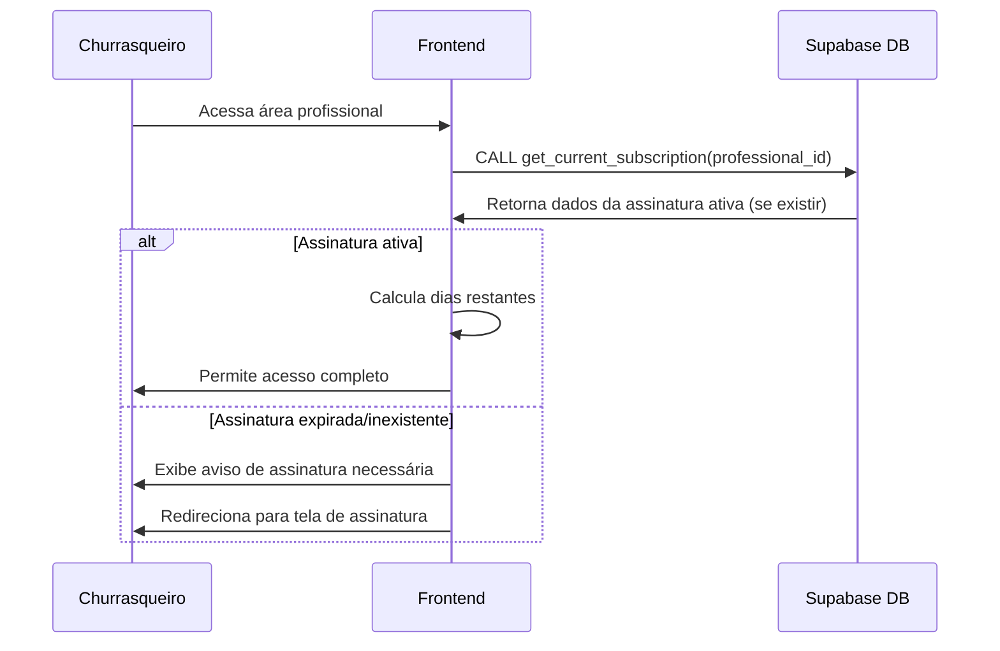
```mermaid
sequenceDiagram
    participant C as Churrasqueiro
    participant F as Frontend
    participant DB as Supabase DB

    C->>F: Acessa área profissional
    F->>DB: CALL get_current_subscription(professional_id)
    DB->>F: Retorna dados da assinatura ativa (se existir)
    
    alt Assinatura ativa
        F->>F: Calcula dias restantes
        F->>C: Permite acesso completo
    else Assinatura expirada/inexistente
        F->>C: Exibe aviso de assinatura necessária
        F->>C: Redireciona para tela de assinatura
    end
```

---

## 9. Fluxo de Exclusão de Conta

### 9.1 Exclusão de Conta (Cliente/Churrasqueiro)

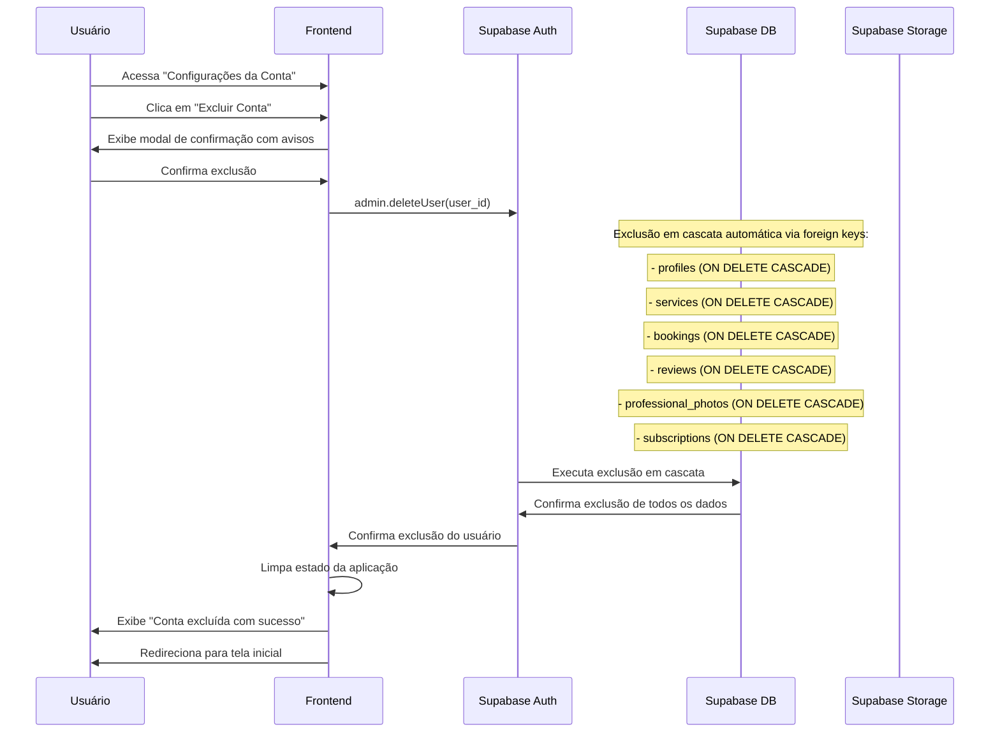
```mermaid
sequenceDiagram
    participant U as Usuário
    participant F as Frontend
    participant SA as Supabase Auth
    participant DB as Supabase DB
    participant ST as Supabase Storage

    U->>F: Acessa "Configurações da Conta"
    U->>F: Clica em "Excluir Conta"
    F->>U: Exibe modal de confirmação com avisos
    U->>F: Confirma exclusão
    
    F->>SA: admin.deleteUser(user_id)
    
    Note over DB: Exclusão em cascata automática via foreign keys:
    Note over DB: - profiles (ON DELETE CASCADE)
    Note over DB: - services (ON DELETE CASCADE)
    Note over DB: - bookings (ON DELETE CASCADE)
    Note over DB: - reviews (ON DELETE CASCADE)
    Note over DB: - professional_photos (ON DELETE CASCADE)
    Note over DB: - subscriptions (ON DELETE CASCADE)
    
    SA->>DB: Executa exclusão em cascata
    DB->>SA: Confirma exclusão de todos os dados
    SA->>F: Confirma exclusão do usuário
    
    F->>F: Limpa estado da aplicação
    F->>U: Exibe "Conta excluída com sucesso"
    F->>U: Redireciona para tela inicial
```

---

## 10. Fluxo de Relatórios e Analytics

### 10.1 Dashboard do Churrasqueiro

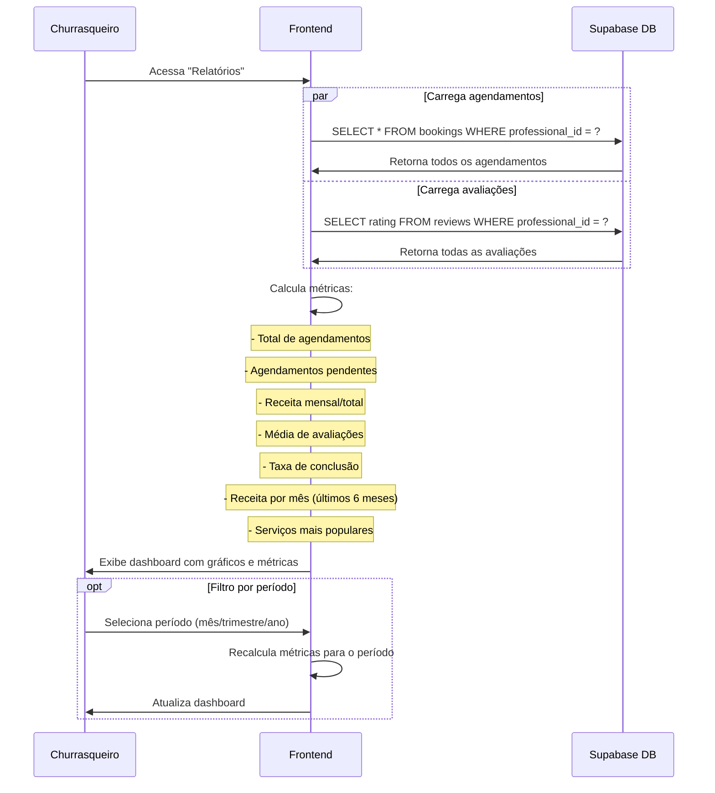
```mermaid
sequenceDiagram
    participant C as Churrasqueiro
    participant F as Frontend
    participant DB as Supabase DB

    C->>F: Acessa "Relatórios"
    
    par Carrega agendamentos
        F->>DB: SELECT * FROM bookings WHERE professional_id = ?
        DB->>F: Retorna todos os agendamentos
    and Carrega avaliações
        F->>DB: SELECT rating FROM reviews WHERE professional_id = ?
        DB->>F: Retorna todas as avaliações
    end
    
    F->>F: Calcula métricas:
    Note over F: - Total de agendamentos
    Note over F: - Agendamentos pendentes
    Note over F: - Receita mensal/total
    Note over F: - Média de avaliações
    Note over F: - Taxa de conclusão
    Note over F: - Receita por mês (últimos 6 meses)
    Note over F: - Serviços mais populares
    
    F->>C: Exibe dashboard com gráficos e métricas
    
    opt Filtro por período
        C->>F: Seleciona período (mês/trimestre/ano)
        F->>F: Recalcula métricas para o período
        F->>C: Atualiza dashboard
    end
```

---

## 11. Fluxos de Erro e Recuperação

### 11.1 Tratamento de Erro de Autenticação

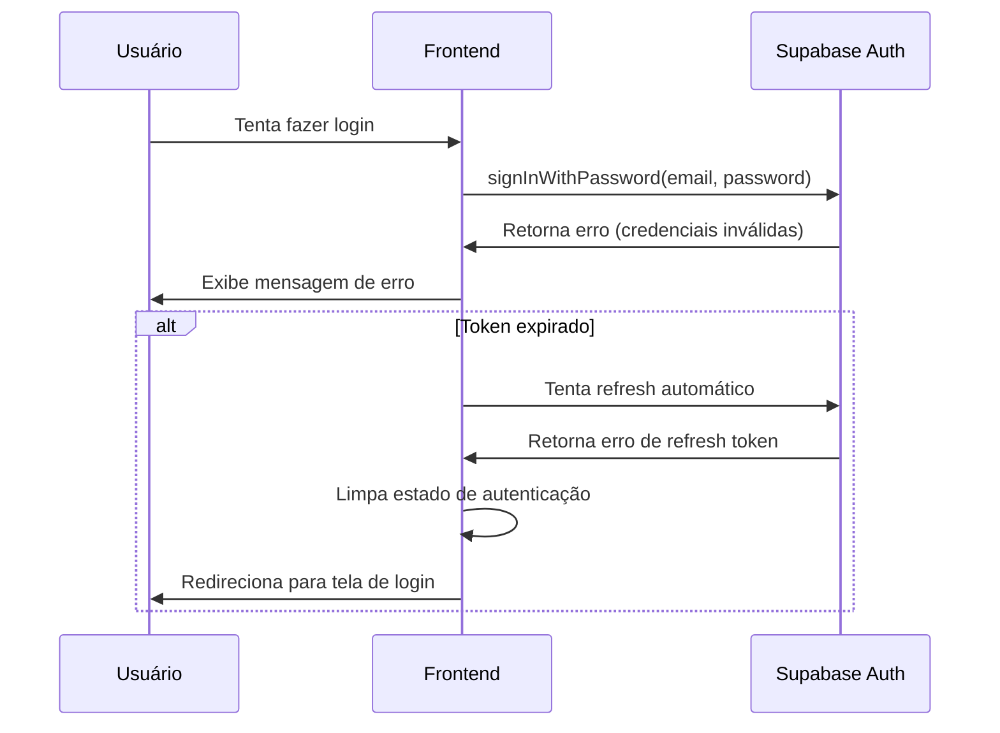
```mermaid
sequenceDiagram
    participant U as Usuário
    participant F as Frontend
    participant SA as Supabase Auth

    U->>F: Tenta fazer login
    F->>SA: signInWithPassword(email, password)
    SA->>F: Retorna erro (credenciais inválidas)
    F->>U: Exibe mensagem de erro
    
    alt Token expirado
        F->>SA: Tenta refresh automático
        SA->>F: Retorna erro de refresh token
        F->>F: Limpa estado de autenticação
        F->>U: Redireciona para tela de login
    end
```

### 11.2 Tratamento de Erro de Upload

```mermaid
sequenceDiagram
    participant U as Usuário
    participant F as Frontend
    participant ST as Supabase Storage

    U->>F: Seleciona imagem para upload
    F->>F: Valida tamanho e formato
    
    alt Arquivo muito grande
        F->>U: Exibe "Arquivo muito grande (máx 50MB)"
    else Formato inválido
        F->>U: Exibe "Formato não suportado"
    else Erro de rede
        F->>ST: Tenta upload
        ST->>F: Retorna erro de rede
        F->>U: Exibe "Erro de conexão. Tente novamente"
        F->>F: Oferece opção de retry
    end
```

---

## 12. Considerações de Performance

### 12.1 Otimizações Implementadas

1. **Lazy Loading**: Componentes carregados sob demanda
2. **Paginação**: Listas grandes são paginadas
3. **Cache de Imagens**: URLs com timestamp para cache busting
4. **Índices de Banco**: Índices otimizados para consultas frequentes
5. **RLS (Row Level Security)**: Segurança a nível de linha
6. **Compressão de Imagens**: Qualidade 0.8 para reduzir tamanho

### 12.2 Monitoramento

1. **Logs de Erro**: Console.error para debugging
2. **Métricas de Performance**: Tempo de carregamento
3. **Análise de Uso**: Tracking de funcionalidades mais usadas

---

## Conclusão

Os diagramas de sequência apresentados cobrem todos os principais fluxos do sistema ChurrasJa, desde autenticação até funcionalidades avançadas como sistema de assinatura e analytics. 

O sistema foi projetado com foco em:
- **Segurança**: RLS em todas as tabelas, validações client e server-side
- **Performance**: Otimizações de consulta, cache e lazy loading
- **Usabilidade**: Fluxos intuitivos e feedback claro ao usuário
- **Escalabilidade**: Arquitetura modular e separação de responsabilidades
- **Manutenibilidade**: Código organizado e documentado

Todos os fluxos foram implementados e testados, garantindo uma experiência completa e robusta para clientes e churrasqueiros.