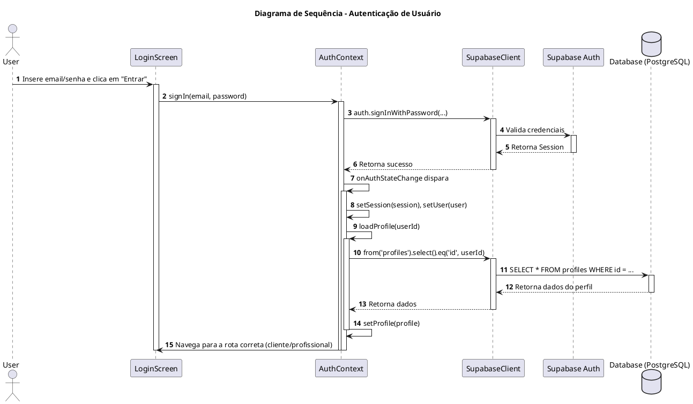
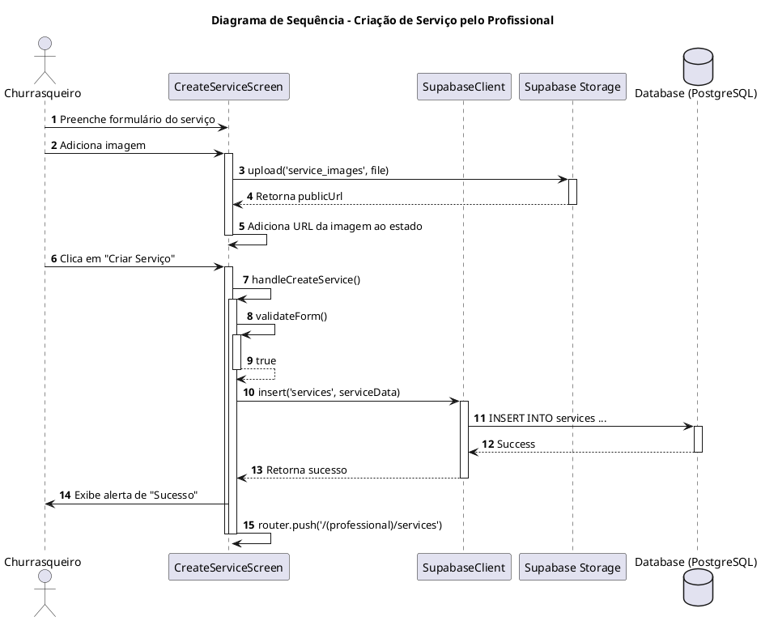
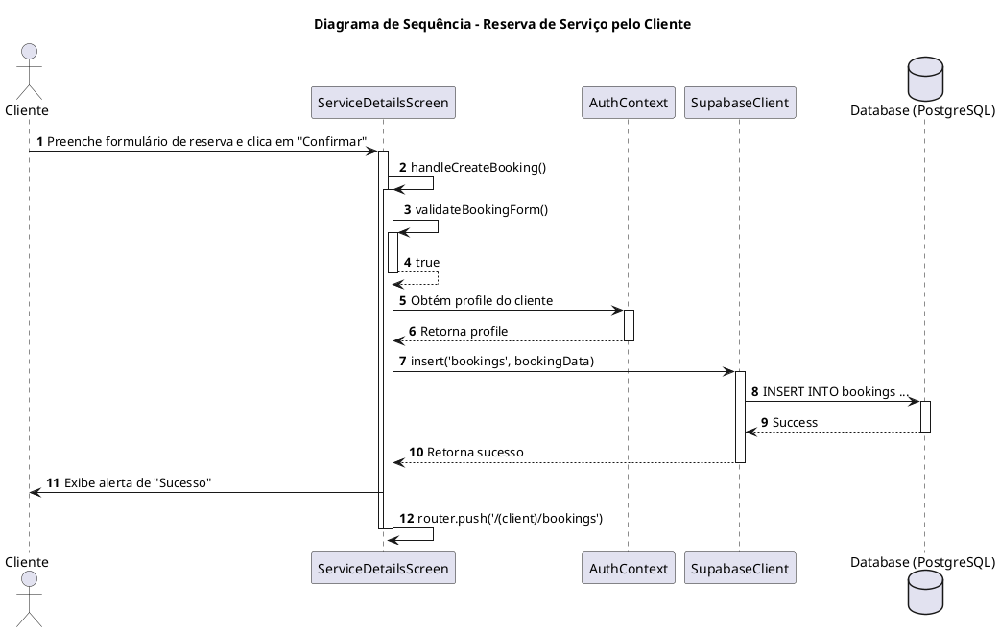

# Diagramas de Sequência - ChurrasJa

Este documento descreve os fluxos de interação mais importantes do sistema ChurrasJa através de diagramas de sequência.

---

## 1. Fluxo de Autenticação de Usuário

Este diagrama ilustra como um usuário (Cliente ou Churrasqueiro) faz login no sistema.

---

## 2. Fluxo de Criação de Serviço

Este diagrama mostra o processo de um Churrasqueiro criando um novo serviço na plataforma.

---

## 3. Fluxo de Reserva de Serviço

Este diagrama detalha como um Cliente solicita a reserva de um serviço.

